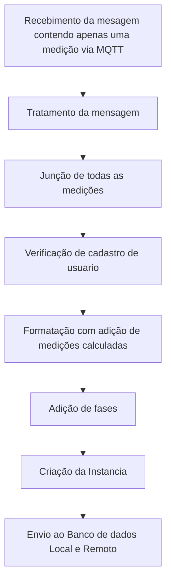

<div  Align="justify">
	
# Sumario
- [Node-red](#node-red)
	- [Mode de Execução](#mode-de-execucao)
	- [Funcionalidade Node-red](#funcionamento-node-red)
		- [Ferramentas](#ferramentas)
			- [Nodes](#nodes)
			- [Flows](#flows)
			- [Subflows](#subflows)
	- [Implementação](#implementação)
		- [Receive Data](#receive-data)
		- [Postgres](#postgres)
		- [Subflows](#subflows)
			- [MQTT](#mqtt)
			- [Tratamento da Mensagem](#tratamento-da-mensagem)
			- [Formatação](#formatacao)
			- [Verifica cadastro](#verifica-cadastro)
			- [phase](#phase)
			- [Cria Instancia](#cria-instancia)
			- [Envio ao Banco](#envio-ao-banco)
			- [Sincronismo Medições](#sincronismo-medicoes)
			- [Sincronismo Local](#sincronismo-local)
			- [Sincronismo tamanho banco local](#sincronismo-tamanho-banco-local)
- [Conclusão](#conclusao)
- [Autor](#autor)
- [Anexos](#anexos)
	- [Anexo I - Aedes MQTT](#anexo-1)
	- [Anexo II - Não nulos](#anexo-2)
	- [Anexo III - Existe dados](#anexo-3)
	- [Anexo IV - convert payload](#anexo-4)
	- [Anexo V - Reconfigurção](#anexo-5)
	- [Anexo VI - Transformação String](#anexo-6)
	- [Anexo VII - Identificação fase](#anexo-7)
	- [Anexo VIII - Junção (Monofasico/Bifasico/Trifasico)](#anexo-8)
	- [Anexo IX - Junção e Alteração](#anexo-9)
	- [Anexo X - Recuperação](#anexo-10)
	- [Anexo XI - Remoção](#anexo-11)
	- [Anexo XII - Formatação](#anexo-12)
	- [Anexo XIII - Contador de mensagens](#anexo-13)
	- [Anexo XIV - Duplica](#anexo-14)
	- [Anexo XV - postgresql](#anexo-15)
	- [Anexo XVI - Verifica Cadastro no banco](#anexo-16)
	- [Anexo XVII - postgresql](#anexo-17)
	- [Anexo XVIII - Segregação](#anexo-18)
	- [Anexo XIX - Identificação instalação](#anexo-19)
	- [Anexo XX - Cria instancia Monofasico](#anexo-20)
	- [Anexo XXI - Cria instancia Bifasico](#anexo-21)
	- [Anexo XXI - Cria instancia Trifasico](#anexo-22)
	- [Anexo XXIII - Parametros](#anexo-23)
	
	- [Anexo XXIV - Data ultima medição adicionada no remoto](#anexo-24)
	- [Anexo XXV - Data ultima medição adicionada no local](#anexo-25)
	- [Anexo XXVI - cria msg.last_update](#anexo-26)
	- [Anexo XXVII - cria msg.last_upload](#anexo-27)
	- [Anexo XXVIII - pega ID da ultima medição no banco local](#anexo-28)
	- [Anexo XXIX - cria msg.last_update_id](#anexo-29)
	- [Anexo XXX - incrementa](#anexo-30)
	- [Anexo XXXI - Pega medição](#anexo-31)
	- [Anexo XXXII - cria msg.measurement](#anexo-32)
	- [Anexo XXXIII - Verifica se já existe](#anexo-33)
	- [Anexo XXXIV - switch](#anexo-34)
	- [Anexo XXXV - Pega frequency](#anexo-35)
	- [Anexo XXXVI - cria msg.frequency](#anexo-36)
	- [Anexo XXXVII - Pega power](#anexo-37)
	- [Anexo XXXVIII - cria msg.power (ABC)](#anexo-38)
	- [Anexo XXXIX - Pega sensor](#anexo-39)
	- [Anexo XL - cria msg.sensor](#anexo-40)
	- [Anexo XLI - Pega voltagelag](#anexo-41)
	- [Anexo XLII - cria msg.voltagelag (ABC)](#anexo-42)
	- [Anexo XLIII - Pega energy](#anexo-43)
	- [Anexo XLIV - cria msg.energy (ABC)](#anexo-44)
	- [Anexo XLV - instancia](#anexo-45)
	- [Anexo XLVI - contador (access_user)](#anexo-46)
	- [Anexo XLVII - NOCS](#anexo-47)
	- [Anexo XLVIII - cria msg.nocs](#anexo-48)
	- [Anexo XLIX - Local](#anexo-49)
	- [Anexo L - cria msg.local](#anexo-50)
	- [Anexo LI - criação e atualizção (access_user)](#anexo-51)
	- [Anexo LII - Switch (access_user)](#anexo-52)
	- [Anexo LIII - Local - Data do primeiro dado](#anexo-53)
	- [Anexo LIV - Local - Data do ultimo dado](#anexo-54)
	- [Anexo LV - cria msg.date_inicial](#anexo-55)
	- [Anexo LVI - cria msg.date_atual](#anexo-56)
	- [Anexo LVII - Verifica datas](#anexo-57)

# <a name=“node-red”><a/>Node-red

Repositorio contendo todos os arquivos de configuração, palette e desenvolvimento do node-red para recebimento tratamento e disposição dos dados de medição de consumo ao banco dde dados.

<div> </div>


## <a name="mode-de-execucao"><a/>Modo de execução

Para executar essas configurações no Node-RED, é preciso ter instalado o Node-RED e o Postgres via Docker, como mostrado neste outro repositório ([instalação Docker](https://hub.docker.com/r/arthurcoelho442/monitor)).

**Atualização do sistema**

```
sudo apt-get update && apt-get upgrade -y
```


**Entre no modo de navegação root**
```
sudo su
```

**Navegue até a pasta do node-red**
```
cd /home/pi/node-red
```

**Inicialize o repositorio**
```
git init
```

**Adicione o repositorio remoto**
```
git remote add origin https://github.com/CPID-NOCS/node-red.git
```

**Limpe o repositorio local**
```
git clean -f
```

**Pegue as alterações do repositorio remoto**
```
git pull -f origin main
```
	
pronto basta entrar com suas credenciais e logo logo as configurações serão baixadas.

## <a name=“funcionamento-node-red”><a/>Funcionamento Node-Red

Node-RED é uma plataforma open-source baseada em Node.js para desenvolver aplicativos IoT (Internet of Things) e integração de sistemas. Ele permite que os usuários criem fluxos de trabalho visualmente, conectando nós pré-construídos de uma vasta biblioteca, chamados de nodes.

Os usuários podem criar um fluxo de trabalho usando uma interface gráfica de arrastar e soltar para conectar os nodes e criar uma lógica de programação. Os nodes podem ser usados para realizar ações como processamento de dados, controle de dispositivos, leitura e gravação em bancos de dados, envio e recebimento de dados via MQTT, HTTP, entre outros protocolos.

Os fluxos criados podem ser facilmente implantados em diferentes plataformas, incluindo nuvem, dispositivos locais e até mesmo em Raspberry Pi. Node-RED é altamente personalizável e extensível, permitindo que os usuários adicionem seus próprios nodes e personalizem os existentes para atender às suas necessidades.

Após a instalação, ao acessar a ferramenta você terá os seguintes componentes na tela.

- Lado esquerdo: Paleta com todos os Nodes (Nós) instalados.
- Centro: Ambiente de desenvolvimento. Onde ficam os Flows criados com suas automações baseado em nós.
- Lado direito: Você tem um conjunto de informações, área de ajuda, área de debug, configurações de layout.

<br>

> ### <a name=“ferramentas”><a/>Ferramentas

#### <a name=“nodes”><a/>Nodes

Nodes são os blocos de construção básicos do Node-RED, cada um representando uma função ou serviço específico. Os nodes são organizados em categorias, como entrada (input), saída (output), processamento (processing) e controle (function), e podem ser facilmente adicionados ao fluxo de trabalho arrastando e soltando da biblioteca de nodes.

<div align="center">
    <br>    
</div>

Os nodes incluem recursos como entrada de dados, conversão de dados, processamento de dados, saída de dados e controle de fluxo. Eles também podem ser personalizados e estendidos pelos usuários para atender às suas necessidades específicas.

#### <a name=“flows”><a/>Flows

Flows são o conjunto de nodes que formam o fluxo de trabalho em Node-RED. Os fluxos são criados arrastando e soltando os nodes na interface gráfica e conectando-os para criar uma lógica de programação visual. Os fluxos podem ser facilmente modificados, adicionando ou removendo nodes ou reorganizando sua conexão.

|<br> | <br> |
| :---: | :---: |

O Node-RED suporta a importação e exportação de fluxos, o que permite compartilhar e reutilizar fluxos entre usuários. Além disso, o Node-RED inclui um recurso de versionamento de fluxo que permite salvar e recuperar versões anteriores do fluxo.

#### <a name=“subflows”><a/>Subflows

Subflows são fluxos menores que podem ser encapsulados e reutilizados em um fluxo maior. Eles são úteis quando um conjunto de nodes é usado várias vezes em diferentes fluxos, permitindo que o usuário crie um subfluxo separado que pode ser adicionado a outros fluxos.

<div align="center">
    <br> 
</div>

Os subflows funcionam como nodes, mas contêm seu próprio conjunto de nodes e conexões. Eles podem ser facilmente criados arrastando e soltando nodes e conexões para um novo fluxo e salvando-o como um subfluxo. Os subfluxos são então adicionados ao fluxo principal arrastando e soltando como um único node.

## <a name=“implementação”><a/>Implementação

Inicialmente, temos todos os nodes separados em dois fluxos: o **Receive Data** e o **Postgres**. No primeiro fluxo, o **Receive Data**, temos o processo de recebimento, tratamento e adição de informações. Já no segundo, o **Postgres**, temos os nodes responsáveis pela comunicação entre o Node-RED e o banco de dados PostgreSQL. 



É importante ressaltar que em ambos os fluxos são utilizados subflows para simplificar o processo. Abaixo, seram destacados as funcionalidades e configurações de cada fluxo.

>### <a name=“receive-data”><a/>Receive Data

<div align="center">
    <br>
</div>

O fluxo de dados no receive se da na aquisição dos dados que veem via mqtt no subflow ***MQTT***, sendo que as mensagens eviadas pelos medidores da IE veem de forma separada, como por exemplo no medidor trifasico são enviados os dados separadamente, potencia ativa, potencia retiva, potencia aparente, corrent, tensão, fator de potencia, defasagem, etc, cada um em uma mensagem separada, logo no subflow ***Tratamento da mensagem*** as mensagem são tratadas e unidas para posteriormente serem formatadas no subflow ***Formatação***.

Logo abaixo temos uma mensagem que chega do medidor referente à corrente de fase A:

```json
{
  "packet": {
    "cmd" : "publish",
    "retain": false,
    "qos": 0,
    "dup" : false,
    "length" : "58",
    "topic" : "Trifasico",
    "payload": buffer[42]
  }
  "client":{}
}
```

Percebe-se que esta mensagem, além de conter o payload no formato buffer, contém também todos os dados do MQTT, como configuração de tópico, subtop, entre outros, sendo simplificada para se tornar:
```json
{
  "id" : "publish",
  "topic" : "Trifasico",
  "current_A": 0.83
}
```

Contudo, é unida a outras mensagens, tornando-se:

```json
{
    "id": "5",
    "topic": "Trifasico",
    "active_power_A": 67.93,
    "active_power_B": 121.27,
    "active_power_C": 30.11,
    "reactive_power_A": 59.5,
    "reactive_power_B": 97.7,
    "reactive_power_C": 4.59,
    "apparent_power_A": 90.27,
    "apparent_power_B": 155.72,
    "apparent_power_C": 30.46,
    "voltage_A": 128.04,
    "voltage_B": 128.25,
    "voltage_C": 128.75,
    "current_A": 0.84,
    "current_B": 1.22,
    "current_C": 0.3,
    "power_factor_A": 0.75,
    "power_factor_B": 0.77,
    "power_factor_C": 0.98,
    "voltage_current_angle_A": -90.03,
    "voltage_current_angle_B": 38.72,
    "voltage_current_angle_C": -90.03,
    "frequency": 59.97,
    "angle_voltage_A_B": 119.54,
    "angle_voltage_A_C": 240.18,
    "angle_voltage_B_C": 120.27,
    "temperature": 35.89
} 
```
Essa mensagem contém apenas os valores que serão utilizados para criar a instância de inserção dos dados no banco de dados.

>### <a name=“postgres”><a/>Postgres

<div align="center">
    <br>
</div>

O fluxo do Postgres funciona como uma ferramenta de conexão entre o Node-RED e o banco de dados, permitindo diversas interações com o banco. Por exemplo, é possível verificar o cadastro de um determinado usuário, sincronizar as tabelas locais com as informações do banco remoto, solicitar quais fases estão associadas a determinada medição, manter o banco de dados com uma quantidade específica de dados para evitar sobrecarga de memória e, por fim, inserir os dados medidos no banco de dados remoto.

Dentro desse fluxo, temos vários subfluxos que facilitam o trabalho com o banco de dados. Por exemplo, o subfluxo ***Verifica cadastro*** e ***phase*** fazem requisições ao banco remoto para averiguar informações. O subfluxo ***cria instancia*** é responsável por criar a instância no formato correto para inserção no banco de dados, e dentro dele, temos o subfluxo oculto ***sincronismo medições***, que detecta discrepâncias entre medições locais e remotas e envia as medições locais faltantes para o banco remoto.

Temos também o subfluxo ***envia ao banco***, que envia a medição já instanciada para o banco local e remoto, e o subfluxo oculto ***sincronismo local***, que mantém as tabelas locais de cadastro atualizadas com o banco remoto. Por fim, o subfluxo ***sincronismo tamanho banco local*** mantém o tamanho do banco de dados local em um tamanho fixo.

Para termos um funcionamento adequado dos nodulos responsaveis pela comunicação com o postgresql, temos 4 configurações a serem efetuadas, logo abaixo temos o nó e qual configuração deve ser feita nele:
	
<br>
	
|<br><sub>Local</sub> | <br><sub>Remoto</sub>|
| :---: | :---: |

<br>

|<br><sub>Local-Connection</sub> | <br><sub>Local-Security</sub>|
| :---: | :---: |
|<br><sub>**Remoto-Connection**</sub> | <br><sub>**Remoto-Security**</sub>|

Perceba que no banco local o host é dado como postgres, pois o node-red esta no docker e esta na mesma rede do conteiner postgres.
	
>### <a name=“subflows”><a/>Subflows

Agora vamos entrar em detalhes do funcionamento de cada subflow conttido nas dependencias do node-red.

#### <a name=“mqtt”><a/>MQTT

O subflow ***MQTT*** tem a função de capturar as mensagens recebidas pelo Node-RED local por meio do MQTT na porta 1883. Para garantir a qualidade das mensagens, o subflow transmite apenas aquelas que não possuem falhas, como mensagens nulas ou com payload vazio.

<div align="center">
    <br>
</div>

O fluxo do subflow começa com um node chamado **Aedes MQTT** (configuração no [Anexo-I](#anexo-1)), que funciona como um mosquito broker e coleta todas as mensagens que chegam na porta 1883 da Raspberry Pi. Em seguida, a mensagem passa pelo node **Não nulos** (configuração no [Anexo-II](#anexo-2)), que verifica se a mensagem não está vazia e se está conectada. Essas informações são cruciais para garantir a consistência das mensagens recebidas. Por fim, a mensagem passa pelo node **Existe dados** (configuração no [Anexo-III](#anexo-3)), que verifica se o payload da mensagem contém dados ou está vazio.

Além desses nodes, o subflow ***MQTT*** também possui nodes de status que informam a situação atual do node (conectado ou desconectado) e um node de aviso que informa caso ocorra algum problema em qualquer node do subflow.

#### <a name=“tratamento-da-mensagem”><a/>Tratamento da mensagem
O subfluxo ***Tratamento da mensagem*** é separado em dois fluxos: 

- Uma *Reconfiguração* que altera o formato da mensagem inicial, removendo informações que não são relevantes e remontando o objeto para uma melhor representação;

- E um *Identificação de Tópico e Junção*, que junta as mensagens de acordo com o tópico;

<div align="center">
    <br>
</div>
	
O objeto inicial chega no formato:
```json
{
  "packet": {
    "cmd" : "publish",
    "retain": false,
    "qos": 0,
    "dup" : false,
    "length" : "58",
    "topic" : "Trifasico",
    "payload": buffer[42]
  }
  "client":{}
}
```
e passa a ter o seguinte formato após a reconfiguração no primeiro fluxo:
```json
{
	"id":"5",
	"topic":"Trifasico",
	"variable":"IA",
	"value":1.08,
	"unit":"A"
}
```
Esse processo é realizado através dos nodos **convert payload** (configuração no [Anexo-IV](#anexo-4)), que converte o formato payload de buffer para um objeto JSON, e posteriormente as informações irrelevantes são removidas e o payload é reorganizado pelo nodulo **Reconfiguração** (configuração no [Anexo-V](#anexo-5)). Por fim, a mensagem é transformada em uma string JSON no nodulo **Trasformação String** (configuração no [Anexo-VI](#anexo-6)) para facilitar a união com as mensagens seguintes no fluxo de *Identificação de Tópico e Junção*. A união ocorre de forma diferente para cada tipo de módulo (monofásico, bifásico e trifásico), pois temos uma quantidade diferente de mensagens a serem unidas. Cada mensagem é identificada pelo nodulo **Identificação de fase** (configuração no [Anexo-VII](#anexo-7)), através do tópico em que a mensagem foi publicada. A união é realizada pelos nodulos **Junção Monofásico**, **Junção Bifásico** e **Junção Trifásico** (configuração de ambos no [Anexo-VIII](#anexo-8)).

Após a união, é necessário modificar a mensagem resultante, que chega no seguinte formato:
```
{"id":"5","topic":"Trifasico","variable":"PA","value":94.87,"unit":"W"},{"id":"5","topic":"Trifasico","variable":"PB","value":117.4,"unit":"W"},{"id":"5","topic":"Trifasico","variable":"PC","value":64.71,"unit":"W"},...}
```
Para isso removemos as junções `"},{"` e alteramos o formato basico de cada menagem, no caso da corrente de Fase A, a mensagem `{"id":"5","topic":"Trifasico","variable":"IA","value":1.08,"unit":"W"}` passa a ser `{"id":"5", topic":"Trifasico", "variable":"IA", value":1.08, unit":"A"}` e é unida as outras. Isso é feito pelo nodulo **Junção e Alteração** (configuração no [Anexo-IX](#anexo-9)).

Recuperação da Mensagem resultante de Json String para Json Object:
```json
{
	"id": "5",
	"topic": "Trifasico",
	"active_power_A": 90.69,
	"unit": "oC",
	"active_power_B": 28.73,
	"active_power_C": 60.69,
	"PT": 180.09,
	"reactive_power_A": 78.39,
	"reactive_power_B": 0.15,
	"reactive_power_C": -4.32,
	"QT": 74.25,
	"apparent_power_A": 119.85,
	"apparent_power_B": 28.73,
	"apparent_power_C": 60.8,
	"ST": 194.72,
	"voltage_A": 127.26,
	"voltage_B": 127.71,
	"voltage_C": 127.94,
	"current_A": 1.04,
	"current_B": 0.3,
	"current_C": 0.68,
	"IT": 0.75,
	"power_factor_A": 0.75,
	"power_factor_B": 0.99,
	"power_factor_C": 0.99,
	...
}
```
	
Muitos desses valores não são utilizados pelo projeto. Após a recuperação da string JSON para objeto JSON no nodulo **Recuperação** (configuração no [Anexo-X](#anexo-10)), os dados não utilizados, como 'unit', 'PT', 'QT', 'ST', e 'IT', são removidos pelo nodulo **Remoção** (configuração no [Anexo-XI](#anexo-11)), deixando o payload no seguinte formato:
	
```json
{
	"id": "5",
	"topic": "Trifasico",
	"active_power_A": 90.69,
	"active_power_B": 28.73,
	"active_power_C": 60.69,
	"reactive_power_A": 78.39,
	"reactive_power_B": 0.15,
	"reactive_power_C": -4.32,
	"apparent_power_A": 119.85,
	"apparent_power_B": 28.73,
	"apparent_power_C": 60.8,
	"voltage_A": 127.26,
	"voltage_B": 127.71,
	"voltage_C": 127.94,
	"current_A": 1.04,
	"current_B": 0.3,
	"current_C": 0.68,
	"power_factor_A": 0.75,
	"power_factor_B": 0.99,
	"power_factor_C": 0.99,
	...
}
```
	
#### <a name="formatacao"><a/>Formatação
Este subfluxo é responsável por fazer as formatações necessárias para o banco de dados. Nele, temos um nó chamado **Formatação** (configuração no [Anexo-XII](#anexo-12)), que possui diversas funcionalidades, incluindo a separação das medidas com casas decimais e a representação dos valores em notação científica, onde o número de ponto flutuante se torna um inteiro e o valor que o tornou inteiro é representado em outra propriedade chamada ***sf*** (abreviação para "scientific format").

<div align=center>
	<br>
</div>
	
Portanto, uma entrada equivalente a:
	
```json
{
	"id": "5",
	"topic": "Trifasico",
	"active_power_A": 90.69,
	"active_power_B": 28.73,
	"active_power_C": 60.69,
	...
}
```
	
Torna-se:

```json
{
	"id": "5",
	"topic": "Trifasico",
	"active_power_A": 9069,
	"active_power_B": 2873,
	"active_power_C": 6069,
	"active_power_A_sf": -2,
	"active_power_B_sf": -2,
	"active_power_C_sf": -2,
	...
}
```
Outras funcionalidades deste nó é realizar o cálculo de medições que alguns módulos não executam, como a potência reativa, a potência aparente, o defasamento, entre outros, além disso temos um fluxo *Contador de mensagens* (configuração dos dois nodulos do fluxo no [Anexo-XIII](#anexo-13)) responsavel por zerar o contador de mensagens caso a varizavel do subflow **zerar** esteja selecionada nas opções de configuração do subflow, como a imagem abaixo mostra.

<div align=center>
	<br>
</div>

#### <a name=“verifica-cadastro”><a/>Verifica cadastro
Este subflow é responsável por verificar se o ID da mensagem que chegou no payload está cadastrado no banco de dados. Caso contrário, a mensagem não pode ser armazenada no banco. Para isso, no início do fluxo, a mensagem é duplicada pelo nó **Duplica** (configuração no [Anexo-XIV](#anexo-14)) pois o segundo nó utilizado, responsável pela verificação, sobrescreve o payload da mensagem. Logo, para não haver perdas, a mensagem é duplicada. No segundo nó **postgreSQL** (configuração no [Anexo-XV](#anexo-15)), temos uma query que busca o ID do mqtt_access referente ao ID do cliente da mensagem. Caso esse ID não seja definido, significa que o ID da mensagem não possui cadastro. Nesse caso, a mensagem é enviada ao subflow ***Sincronismo Local*** para verificar se as tabelas locais estão devidamente atualizadas, essa descisão e tomada pelo nó **Verifica Cadastro no banco** (configuração no [Anexo-XVI](#anexo-16)).

<div align=center>
	<br>
</div>
	
#### <a name=“phase”><a/>phase

Este subflow funciona de forma similar ao subflow ***Verifica cadastro***, fazendo uma consulta ao banco de dados. Para isso, no início do fluxo, a mensagem é duplicada pelo nó **Duplica** (configuração no [Anexo-XIV](#anexo-14)). No segundo nó **postgreSQL** (configuração no [Anexo-XVII](#anexo-17)), temos uma consulta que busca as fases do circuito de acordo com o mqtt_id da mensagem. Caso nenhuma fase seja encontrada, a mensagem é descartada.
	
<div align=center>
	<br>
</div>

Dessa forma, a mensagem que chega nesse formato:
```json
{
	"id": "5",
	"topic": "Trifasico",
	"active_power_A": 9069,
	"active_power_B": 2873,
	"active_power_C": 6069,
	"active_power_A_sf": -2,
	"active_power_B_sf": -2,
	"active_power_C_sf": -2,
	...
}
```
se torna:
```json
{
	"id": "5",
	"topic": "Trifasico",
	"active_power_A": 9069,
	"active_power_B": 2873,
	"active_power_C": 6069,
	"active_power_A_sf": -2,
	"active_power_B_sf": -2,
	"active_power_C_sf": -2,
	"phase_A": "C",
	"phase_B": "A",
	"phase_C": "B",
	...
}
```
Lembrando que phase_A, assim como todas medições com "_A" representa a primeira fase. Portanto, se na instalação a primeira fase for a fase C, no código será representada por A, essa indexação é efetuada pelo nó **Segregação** (configuração no [Anexo-XVIII](#anexo-18)), além disso caso haja algum erro e mandada uma mensagem para o subflow ***Sincronismo Local*** para atualizar as tabelas locais de cadastro do banco local.
	
#### <a name="cria-instancia"><a/>Cria Instancia
O subflow ***cria-instancia*** é responsável por criar uma mensagem de inserção no formato SQL com os dados vindos do payload.

<div align="center">
	<br>	
</div>
	
A mensagem que chega no subflow passa por um nó de switch para identificar o tipo de fase do circuito, semelhante ao **identificação fase** do subflow ***Tratamento da mensagem***. No entanto, a identificação é realizada com o objeto JSON, e não com a string JSON. O nó **Identificação instalação** é responsável por essa identificação e está configurado no  [Anexo-XIX](#anexo-19).
	
Após a identificação, a mensagem é encaminhada para a instanciação de acordo com o tipo de instalação. A grande diferença entre as instancias (Monofásica (configuração no [Anexo-XX](#anexo-20), Bifásica (configuração no [Anexo-XXI](#anexo-21) e Trifásica (configuração no [Anexo-XXII](#anexo-22)) está na instanciação das fases B e C.

No caso do monofásico, temos apenas uma tabela de EnergyMeasure e uma de PowerMeasure, referentes à fase A. No bifásico, temos a presença da fase B, resultando em duas tabelas de EnergyMeasure e duas de PowerMeasure. Já no trifásico, temos três tabelas de cada uma, respectivamente. Também temos a tabela de VoltageLagMeasurement presente no bifásico e trifásico, representando a defasagem entre as tensões de cada fase.
	
Portanto, quando um payload chega neste formato em específico, como exemplificado abaixo:
```json
{
	"id":"5",
	"topic":"Trifasico",
	"active_power_A":6773
	,"active_power_B":12008,
	"active_power_C":3042,
	"reactive_power_A":5851,
	"reactive_power_B":9782,
	"reactive_power_C":471,
	"apparent_power_A":895,
	"apparent_power_B":15487,
	"apparent_power_C":3076,
	"voltage_A":12765,
	"voltage_B":12805,
	"voltage_C":12854,
	"current_A":83,
	"current_B":121,
	"current_C":28,
	"power_factor_A":0.75,
	"power_factor_B":0.77,
	"power_factor_C":0.98,
	"voltage_current_angle_A":-9004,
	"voltage_current_angle_B":385,
	"voltage_current_angle_C":-9004,
	"frequency":5997,
	...
}
```
Ele passa a ser tratado de acordo com o tipo de instalação identificado e é instanciado de acordo com as configurações específicas de cada instalação, similar ao formato abaixo:
```SQL
INSERT INTO public.organic_nodes_control_measurement(
	date_time_stamp,	message_counter,	setup_id,	source)
	VALUES ('2023-03-16T12:24:13.473Z', 1, (SELECT id FROM public.organic_nodes_control_setup WHERE (device_id = (SELECT device_id FROM public.organic_nodes_control_mqttdevice WHERE (mqtt_access_id = (SELECT id FROM public.organic_nodes_control_mqttaccess WHERE (mqtt_id = '5')))))), 0);

INSERT INTO public.organic_nodes_control_frequencymeasure(
	frequency,	frequency_sf,	measurement_id)
	VALUES (5997, -2, (SELECT id FROM public.organic_nodes_control_measurement WHERE (message_counter = 1 AND date_time_stamp = '2023-03-16T12:24:13.473Z') LIMIT 1));

INSERT INTO public.organic_nodes_control_sensormeasure(
	temperature,	temperature_sf,	measurement_id)
	VALUES (3153, -2, (SELECT id FROM public.organic_nodes_control_measurement WHERE (message_counter = 1 AND date_time_stamp = '2023-03-16T12:24:13.473Z') LIMIT 1));
	
INSERT INTO public.organic_nodes_control_energymeasure(
	phase, current, ...
```

É importante destacar que a cada mensagem instanciada, é enviada uma mensagem para o subflow ***Sincronismo medições***, a fim de manter a sincronia entre as tabelas de medições locais e remotas. Isso é essencial para garantir a precisão dos dados e evitar erros na sincronização, para que, o subflow irá sincronize antes de enviar novas mensagens para o banco remoto.
	
#### <a name="envio-ao-banco"><a/>Envio ao banco
O subflow ***Envia ao banco*** é um subflow simplificado que contém três nós principais. No primeiro nó do fluxo, adiciona-se os parâmetros de envio da mensagem do postgres, nó **Parametros** (configuração no [Anexo-XXIII](#anexo-23)). Nesse nó, há também uma pequena verificação de uma variável global *sincronismo_remoto* referente à sincronização do banco local com o remoto. Se essa variável for verdadeira, significa que uma sincronização está em andamento, portanto, devemos enviar mensagens somente para o banco local, localizado no segundo output do nó. Caso contrário, os bancos estão sincronizados e a mensagem é enviada para ambos o dois outros nós (NOCS e Local), nós configurados conforme especificado em seções anteriores(verificar seção [Postgres](#postgres)).
	
<div align="center">
	<br>
</div>

Caso haja qualquer erro no banco local, é feita uma sincronização local através do subflow de ***Sincronização Local***, para corrigir qualquer falta de informações de cadastro que o banco local possa estar tendo. Após 1 segundo, a mensagem que ocasionou o erro é reenviada para ser armazenada no banco local.	
	
	
	
	
	
	
	
	
	
	
	
	
	
	
#### <a name="sincronismo-medicoes"><a/>Sincronismo Medições

Neste subfluxo, temos quatro fluxos: um para a comparação de datas, outro para o requerimento do ID da medição, outro para a obtenção dos dados das tabelas locais que serão dispostos na tabela remota e, por fim, um último fluxo sequencial, responsável por criar a instância e adicioná-la ao banco de dados.

 
 
	
O funcionamento deste subfluxo se dá pela comparação das datas das últimas medições tanto do banco local quanto do banco remoto. Caso as datas estejam distintas, significa que temos que sincronizar o banco local com o remoto. A data é obtida pelos nós **Data última medição adicionada no remoto** e **Data última medição adicionada no local** (configurados no [Anexo-XXIV](#anexo-24) e [Anexo-XXV](#anexo-25), respctivamente). Para evitar a perda da mensagem dos payloads, ambas são salvas nos nós **Cria msg.last_update** para o banco remoto e **Cria msg.last_upload** para o banco local (configurados no [Anexo-XXVI](#anexo-26) e [Anexo-XXVII](#anexo-27), respctivamente). O próprio nó **cria msg.last_update** faz a comparação das datas e toma a decisão se é ou não necessário fazer a sincronia.
		
Caso seja necessário, passamos para um segundo fluxo, onde é obtido o ID no banco local referente à última medição do banco remoto pelo nó **Pega ID da última medição no banco local** (configuração no [Anexo-XXVIII](#anexo-28)). Feito isso, a mensagem é armazenada em outro payload pelo nó **Cria msg.last_update_id** (configuração no [Anexo-XXIX](#anexo-29)). Esse ID é acrescido pelo nó **Incrementa** (configuração no [Anexo-XXX](#anexo-30)) para que possamos começar a inserir as mensagens que não foram enviadas para o banco.
	
No próximo fluxo, pegamos todas as medições referentes ao ID da tabela de medições locais. A primeira tabela a ser obtida é a tabela *measurement* no nó **Pega medição** (configuração no [Anexo-XXXI](#anexo-31)), pois nela temos as informações essenciais para se instanciar as outras tabelas. Caso a tabela *measurement* retorne vazia, significa que chegamos ao final da sincronização e ambas as tabelas, local e remota, estão sincronizadas. Essa verificação é feita no próprio nó que duplica o payload **cria msg.measurement** (configuração no [Anexo-XXXII](#anexo-32)). Outro tratamento a ser feito é o de verificar se a medição já não está instanciada no banco remoto. Isso é verificado no nó **Verifica se já existe** (configuração no [Anexo-XXXIII](#anexo-33)), que retorna vazio caso não haja nenhuma referência à medição no banco remoto  (verificação efetuada no nó **switch** (configuração no [Anexo-XXXIV](#anexo-34)). Por fim, a instância é criada pelo nó **instancia** (configuração no [Anexo-XLV](#anexo-45)).

> Obs: a inserção é feita mensagem por mensagem, e o restante das configurações dos nós que pegam as medições podem ser encontrados do [Anexo-XXXV](#anexo-35) ao [Anexo-XLIV](#anexo-44)).
	
	
	
	
	
	
	
	
	
#### <a name="sincronismo-local"><a/>Sincronismo Local
Neste subflow, temos um destaque bastante importante: ele é chamado quando ocorre algum erro de sincronização em outros fluxos. Logo, inicialmente, precisamos de um nó que impeça uma sobrecarga de mensagens, de modo a evitar gargalos no sistema de sincronização. O nó utilizado para essa funcionalidade é o *stop timer* da palette **node-red-contrib-stoptimer**. Seu funcionamento é semelhante ao de um nó básico de delay, onde a mensagem espera um determinado tempo para continuar trafegando no fluxo. No entanto, ele difere porque todas as mensagens subsequentes são descartadas durante o intervalo de tempo determinado. Isso não interfere na execução do subflow, pois os nós de sincronização não utilizam a mensagem do payload para sincronizar o banco local. Portanto.
	
 


O objetivo principal deste subflow é sincronizar as tabelas de cadastro locais com as do banco remoto, adicionando, removendo ou atualizando nas tabelas. No total, existem 17 tabelas cadastrais, incluindo access_user, country, state, city, company, area, hardware, firmware, devicesetup, devicecompany, devicetype, device, monitoreddevice, circuit, setup, mqttaccess e mqttdevice. O processo de sincronização é semelhante para todas as tabelas, e abaixo será apresentada a implementação de apenas uma tabela (access_user) para evitar repetições e tornar o arquivo de documentação mais conciso.

Após o nó **espera sincronização** *stoptimer*, que aguarda 1 segundo antes de enviar a mensagem, a mensagem é encaminhada para todos os nós de sincronização das tabelas. Primeiramente, a mensagem passa por um nó **contador** (configuração no [Anexo-XLVI](#anexo-46)), que instancia um contador em uma variável global iniciada com o valor 1. Caso a variável já exista, apenas é obtido o valor que ela armazena. Esse contador será responsável por percorrer todas as linhas da tabela do banco remoto, já que é necessário verificar cada linha para atualizar eventuais mudanças em colunas específicas.
	
O segundo nó do fluxo é o nó de comunicação com o banco remoto **NOCS** (configuração no [Anexo-XLVII](#anexo-47)). Nele, obtemos linha por linha da tabela de acordo com o valor do contador, que é utilizado como índice. Após pegarmos a linha no índice do contador, criamos outro payload para essa mensagem para evitar que ela seja apagada. Essa criação é feita pelo nó **cria msg.nocs** (configuração no [Anexo-XLVIII](#anexo-48)). A mesma coisa é feita para o banco local: pegamos a linha no índice do contador com o nó **Local** (configuração no [Anexo-XLIX](#anexo-49)) e criamos outro payload em **cria msg.local** (configuração no [Anexo-L](#anexo-50)). Com isso, temos três possibilidades a serem tratadas pelo próximo nó, **criação e atualização** (configuração no [Anexo-LI](#anexo-51)):
	
- **DELETE** : caso a mensagem exista no banco local, mas não exista mais no remoto.
- **UPDATE** : caso a mensagem exista no banco local e no remoto, mas com diferenças entre elas.
- **INSERT** : caso a mensagem não exista no banco local, mas exista no banco remoto.
- > Caso nenhuma das duas mensagens exista, significa que chegamos ao final da sincronização, e o contador volta a ter o valor 1. Caso contrário, o contador é acrescido. 
	
Após as decisões tomadas, é gerado um novo payload com a instância escolhida e a mensagem é enviada para dois nós no fluxo. Um deles é o nó **Local** do Postgres (verificar seção [Postgres](#postgres)), e o outro é o nó **switch** (configuração no [Anexo-LII](#anexo-52)), que realiza verificações constantes para verificar o término da sincronização. Essa verificação é executada com base no contador. Se o contador for 1 novamente, o **switch** finaliza o loop. Caso contrário, o switch retorna a mensagem para o nó **contador** no início do fluxo.

#### <a name="sincronismo-tamanho-banco-local"><a/>Sincronismo tamanho banco local
O fluxo deste subfluxo é dividido em dois subfluxos sequenciais. No primeiro, temos a requisição das datas da primeira e última mensagem registrada no banco local, referente a data inicial e atual. A data inicial é obtida pelo nó **Local - Data do primeiro dado** (configuração no [Anexo-LIII](#anexo-53)), enquanto a data final é obtida pelo nó **Local - Data do último dado** (configuração no [Anexo-LVI](#anexo-54)). Como dito em outras seções, os nós do Postgres sobrescrevem o payload local. Logo, para cada um dos nós citados anteriormente a mensagem é colocada em outros payloads secundários: *msg.date_inicial*, instanciado pelo nó **cria msg.date_inicial** (configuração no [Anexo-LV](#anexo-55)), e *msg.date_atual*, instanciado pelo nó **cria msg.date_atual** (configuração no [Anexo-LVI](#anexo-56)).
	
<div align="center">
	<br>
</div>
	
Já no outro subfluxo, temos a verificação do distanciamento entre as duas datas pelo nó **Verifica datas** (configuração no [Anexo-LVII](#anexo-57)). Caso a mensagem inicial tenha extrapolado a quantidade de dias pré-definida, uma instância de delete é enviada ao banco local para apagar a mensagem, e o loop passa para a próxima mensagem do banco. Caso contrário, a sincronização está completa, e o loop se encerra.
	
# <a name="conclusao"><a/>Conclusão

Node-RED é uma plataforma poderosa e flexível para a criação de fluxos de trabalho IoT e integração de sistemas. Com seus nodes personalizáveis, fluxos, subflows e outras ferramentas, é possível criar fluxos complexos de maneira visual e fácil de entender. Com a comunidade ativa de desenvolvedores, há sempre suporte para novos nodes e recursos, tornando o Node-RED uma solução escalável para projetos IoT e de integração de sistemas.

# <a name=“autor”><a/>Autor
| [<br><sub>Arthur Coelho Estevão</sub>](https://github.com/arthurcoelho442) |
| :---: |

# <a name="anexos"><a/>Anexos
Logo abaixo temos todos os anexos de configuração dos nodes
###
---
### <a name="anexo-1"><a/><div align="center"> Anexo I - Aedes MQTT </div>
<div align="center">
    <br>
</div>

---
### <a name="anexo-2"><a/><div align="center"> Anexo II - Não nulos</div>
	
<div align="center"> 
	<br>
</div>
	
---
### <a name="anexo-3"><a/><div align="center"> Anexo III - Existe dados</div>
	
<div align="center"> 
	<br>
</div>

---
### <a name="anexo-4"><a/><div align="center"> Anexo IV - convert payload</div>
	
<div align="center"> 
	<br>
</div>

---
### <a name="anexo-5"><a/><div align="center"> Anexo V - Reconfigurção</div>
	
<div align="center"> 
	<br>
</div>

---

### <a name="anexo-6"><a/><div align="center"> Anexo VI - Transformação String </div>
	
<div align="center"> 
	<br>
</div>

---
### <a name="anexo-7"><a/><div align="center"> Anexo VII - Identificação fase</div>
	
<div align="center"> 
	<br>
</div>

---
### <a name="anexo-8"><a/><div align="center"> Anexo VIII - Junção (Monofasico/Bifasico/Trifasico)</div>
	
| <br><sub>Monofasico</sub> | <br><sub>Bifasico</sub>| <br><sub>Trifasico</sub> |
| :---: | :---: | :---: |

---	
### <a name="anexo-9"><a/><div align="center"> Anexo IX - Junção e Alteração</div>
	
| <br> | <br>| <br> |
| :---: | :---: | :---: |
| <br> | <br>| <br> |

	
---

### <a name="anexo-10"><a/><div align="center"> Anexo X - Recuperação</div>
	
<div align="center"> 
	<br>
</div>

---
### <a name="anexo-11"><a/><div align="center"> Anexo XI - Remoção</div>
	
| <br> | <br>|
| :---: | :---: |

---
### <a name="anexo-12"><a/><div align="center"> Anexo XII - Formatação</div>
	
```javascript
/*current*/
/*A*/
if (typeof msg.payload.current_A != "undefined") {
    if (!Number.isInteger(msg.payload.current_A)) {
        let sf = ("" + ("" + msg.payload.current_A).split('.')[1]).length
        msg.payload.current_A = Math.trunc(msg.payload.current_A * Math.pow(10, sf))
        msg.payload.current_A_sf = -1 * sf
    } else
        msg.payload.current_A_sf = 0
}
/*B*/
if (typeof msg.payload.current_B != "undefined") {
    if (!Number.isInteger(msg.payload.current_B)) {
        let sf = ("" + ("" + msg.payload.current_B).split('.')[1]).length
        msg.payload.current_B = Math.trunc(msg.payload.current_B * Math.pow(10, sf))
        msg.payload.current_B_sf = -1 * sf
    } else
        msg.payload.current_B_sf = 0
}
/*C*/
if (typeof msg.payload.current_C != "undefined") {
    if (!Number.isInteger(msg.payload.current_C)) {
        let sf = ("" + ("" + msg.payload.current_C).split('.')[1]).length
        msg.payload.current_C = Math.trunc(msg.payload.current_C * Math.pow(10, sf))
        msg.payload.current_C_sf = -1 * sf
    } else
        msg.payload.current_C_sf = 0
}

/*voltage*/
/*A*/
if (typeof msg.payload.voltage_A != "undefined") {
    if (!Number.isInteger(msg.payload.voltage_A)){
        let sf = ("" + ("" + msg.payload.voltage_A).split('.')[1]).length
        msg.payload.voltage_A = Math.trunc(msg.payload.voltage_A * Math.pow(10, sf))
        msg.payload.voltage_A_sf = -1 * sf
    }else
        msg.payload.voltage_A_sf = 0
}
/*B*/
if (typeof msg.payload.voltage_B != "undefined") {
    if (!Number.isInteger(msg.payload.voltage_B)) {
        let sf = ("" + ("" + msg.payload.voltage_B).split('.')[1]).length
        msg.payload.voltage_B = Math.trunc(msg.payload.voltage_B * Math.pow(10, sf))
        msg.payload.voltage_B_sf = -1 * sf
    } else
        msg.payload.voltage_B_sf = 0
}
/*C*/
if (typeof msg.payload.voltage_C != "undefined") {
    if (!Number.isInteger(msg.payload.voltage_C)) {
        let sf = ("" + ("" + msg.payload.voltage_C).split('.')[1]).length
        msg.payload.voltage_C = Math.trunc(msg.payload.voltage_C * Math.pow(10, sf))
        msg.payload.voltage_C_sf = -1 * sf
    } else
        msg.payload.voltage_C_sf = 0
}

/*voltage_current_angle*/
/*A*/
if (typeof msg.payload.voltage_current_angle_A != "undefined") {
    if (!Number.isInteger(msg.payload.voltage_current_angle_A)) {
        let sf = ("" + ("" + msg.payload.voltage_current_angle_A).split('.')[1]).length
        msg.payload.voltage_current_angle_A = Math.trunc(msg.payload.voltage_current_angle_A * Math.pow(10, sf))
        msg.payload.voltage_current_angle_A_sf = -1 * sf
    } else
        msg.payload.voltage_current_angle_A_sf = 0
}else if (typeof msg.payload.current_A != "undefined"){
    msg.payload.voltage_current_angle_A = ((Math.acos(msg.payload.power_factor_A) * 180) / Math.PI).toFixed(3)
    
    let sf = ("" + ("" + msg.payload.voltage_current_angle_A).split('.')[1]).length
    msg.payload.voltage_current_angle_A = Math.trunc(msg.payload.voltage_current_angle_A * Math.pow(10, sf))
    msg.payload.voltage_current_angle_A_sf = -1 * sf
} 
/*B*/
if (typeof msg.payload.voltage_current_angle_B != "undefined") {
    if (!Number.isInteger(msg.payload.voltage_current_angle_B)) {
        let sf = ("" + ("" + msg.payload.voltage_current_angle_B).split('.')[1]).length
        msg.payload.voltage_current_angle_B = Math.trunc(msg.payload.voltage_current_angle_B * Math.pow(10, sf))
        msg.payload.voltage_current_angle_B_sf = -1 * sf
    } else
        msg.payload.voltage_current_angle_B_sf = 0
} else if (typeof msg.payload.current_B != "undefined") {
    msg.payload.voltage_current_angle_B = ((Math.acos(msg.payload.power_factor_B) * 180) / Math.PI).toFixed(3)

    let sf = ("" + ("" + msg.payload.voltage_current_angle_B).split('.')[1]).length
    msg.payload.voltage_current_angle_B = Math.trunc(msg.payload.voltage_current_angle_B * Math.pow(10, sf))
    msg.payload.voltage_current_angle_B_sf = -1 * sf
} 
/*C*/
if (typeof msg.payload.voltage_current_angle_C != "undefined") {
    if (!Number.isInteger(msg.payload.voltage_current_angle_C)) {
        let sf = ("" + ("" + msg.payload.voltage_current_angle_C).split('.')[1]).length
        msg.payload.voltage_current_angle_C = Math.trunc(msg.payload.voltage_current_angle_C * Math.pow(10, sf))
        msg.payload.voltage_current_angle_C_sf = -1 * sf
    } else
        msg.payload.voltage_current_angle_C_sf = 0
} else if (typeof msg.payload.current_C != "undefined") {
    msg.payload.voltage_current_angle_C = ((Math.acos(msg.payload.power_factor_C) * 180) / Math.PI).toFixed(3)

    let sf = ("" + ("" + msg.payload.voltage_current_angle_C).split('.')[1]).length
    msg.payload.voltage_current_angle_C = Math.trunc(msg.payload.voltage_current_angle_C * Math.pow(10, sf))
    msg.payload.voltage_current_angle_C_sf = -1 * sf
} 

/*active_power*/
/*A*/
if (typeof msg.payload.active_power_A != "undefined") {
    if (!Number.isInteger(msg.payload.active_power_A)) {
        let sf = ("" + ("" + msg.payload.active_power_A).split('.')[1]).length
        msg.payload.active_power_A = Math.trunc(msg.payload.active_power_A * Math.pow(10, sf))
        msg.payload.active_power_A_sf = -1 * sf
    } else
        msg.payload.active_power_A_sf = 0
} else if (typeof msg.payload.current_A != "undefined"){
    msg.payload.active_power_A = msg.payload.current_A * msg.payload.voltage_A * Math.trunc(msg.payload.power_factor_A*100)
    msg.payload.active_power_A_sf = msg.payload.current_A_sf + msg.payload.voltage_A_sf - 2
}
/*B*/
if (typeof msg.payload.active_power_B != "undefined") {
    if (!Number.isInteger(msg.payload.active_power_B)) {
        let sf = ("" + ("" + msg.payload.active_power_B).split('.')[1]).length
        msg.payload.active_power_B = Math.trunc(msg.payload.active_power_B * Math.pow(10, sf))
        msg.payload.active_power_B_sf = -1 * sf
    } else
        msg.payload.active_power_B_sf = 0
} else if (typeof msg.payload.current_B != "undefined") {
    msg.payload.active_power_B = msg.payload.current_B * msg.payload.voltage_B * Math.trunc(msg.payload.power_factor_B * 100)
    msg.payload.active_power_B_sf = msg.payload.current_B_sf + msg.payload.voltage_B_sf - 2
}
/*C*/
if (typeof msg.payload.active_power_C != "undefined") {
    if (!Number.isInteger(msg.payload.active_power_C)) {
        let sf = ("" + ("" + msg.payload.active_power_C).split('.')[1]).length
        msg.payload.active_power_C = Math.trunc(msg.payload.active_power_C * Math.pow(10, sf))
        msg.payload.active_power_C_sf = -1 * sf
    } else
        msg.payload.active_power_C_sf = 0
} else if (typeof msg.payload.current_C != "undefined") {
    msg.payload.active_power_C = msg.payload.current_C * msg.payload.voltage_C * Math.trunc(msg.payload.power_factor_C * 100)
    msg.payload.active_power_C_sf = msg.payload.current_C_sf + msg.payload.voltage_C_sf - 2
}

/*apparent_power*/
/*A*/
if (typeof msg.payload.apparent_power_A != "undefined") {
    if (!Number.isInteger(msg.payload.apparent_power_A)) {
        let sf = ("" + ("" + msg.payload.apparent_power_A).split('.')[1]).length
        msg.payload.apparent_power_A = Math.trunc(msg.payload.apparent_power_A * Math.pow(10, sf))
        msg.payload.apparent_power_A_sf = -1 * sf
    } else
        msg.payload.apparent_power_A_sf = 0
}else if (typeof msg.payload.current_A != "undefined") {
    msg.payload.apparent_power_A = ((msg.payload.active_power_A * Math.pow(10, msg.payload.active_power_A_sf)) / msg.payload.power_factor_A).toFixed(5)
    
    let sf = ("" + ("" + msg.payload.apparent_power_A).split('.')[1]).length
    msg.payload.apparent_power_A = Math.trunc(msg.payload.apparent_power_A * Math.pow(10, sf))
    msg.payload.apparent_power_A_sf = -1 * sf
}
/*B*/
if (typeof msg.payload.apparent_power_B != "undefined") {
    if (!Number.isInteger(msg.payload.apparent_power_B)) {
        let sf = ("" + ("" + msg.payload.apparent_power_B).split('.')[1]).length
        msg.payload.apparent_power_B = Math.trunc(msg.payload.apparent_power_B * Math.pow(10, sf))
        msg.payload.apparent_power_B_sf = -1 * sf
    } else
        msg.payload.apparent_power_B_sf = 0
} else if (typeof msg.payload.current_B != "undefined") {
    msg.payload.apparent_power_B = ((msg.payload.active_power_B * Math.pow(10, msg.payload.active_power_B_sf)) / msg.payload.power_factor_B).toFixed(5)

    let sf = ("" + ("" + msg.payload.apparent_power_B).split('.')[1]).length
    msg.payload.apparent_power_B = Math.trunc(msg.payload.apparent_power_B * Math.pow(10, sf))
    msg.payload.apparent_power_B_sf = -1 * sf
}
/*C*/
if (typeof msg.payload.apparent_power_C != "undefined") {
    if (!Number.isInteger(msg.payload.apparent_power_C)) {
        let sf = ("" + ("" + msg.payload.apparent_power_C).split('.')[1]).length
        msg.payload.apparent_power_C = Math.trunc(msg.payload.apparent_power_C * Math.pow(10, sf))
        msg.payload.apparent_power_C_sf = -1 * sf
    } else
        msg.payload.apparent_power_C_sf = 0
} else if (typeof msg.payload.current_C != "undefined") {
    msg.payload.apparent_power_C = ((msg.payload.active_power_C * Math.pow(10, msg.payload.active_power_C_sf)) / msg.payload.power_factor_C).toFixed(5)

    let sf = ("" + ("" + msg.payload.apparent_power_C).split('.')[1]).length
    msg.payload.apparent_power_C = Math.trunc(msg.payload.apparent_power_C * Math.pow(10, sf))
    msg.payload.apparent_power_C_sf = -1 * sf
}

/*reactive_power*/
/*A*/
if (typeof msg.payload.reactive_power_A != "undefined") {
    if (!Number.isInteger(msg.payload.reactive_power_A)) {
        let sf = ("" + ("" + msg.payload.reactive_power_A).split('.')[1]).length
        msg.payload.reactive_power_A = Math.trunc(msg.payload.reactive_power_A * Math.pow(10, sf))
        msg.payload.reactive_power_A_sf = -1 * sf
    } else
        msg.payload.reactive_power_A_sf = 0
} else if (typeof msg.payload.current_A != "undefined") {
    msg.payload.reactive_power_A = (Math.sqrt(Math.pow((msg.payload.apparent_power_A * Math.pow(10, msg.payload.apparent_power_A_sf)), 2) - Math.pow((msg.payload.active_power_A * Math.pow(10, msg.payload.active_power_A_sf)), 2))).toFixed(5)
    
    let sf = ("" + ("" + msg.payload.reactive_power_A).split('.')[1]).length
    msg.payload.reactive_power_A = Math.trunc(msg.payload.reactive_power_A * Math.pow(10, sf))
    msg.payload.reactive_power_A_sf = -1 * sf
}
/*B*/
if (typeof msg.payload.reactive_power_B != "undefined") {
    if (!Number.isInteger(msg.payload.reactive_power_B)) {
        let sf = ("" + ("" + msg.payload.reactive_power_B).split('.')[1]).length
        msg.payload.reactive_power_B = Math.trunc(msg.payload.reactive_power_B * Math.pow(10, sf))
        msg.payload.reactive_power_B_sf = -1 * sf
    } else
        msg.payload.reactive_power_B_sf = 0
} else if (typeof msg.payload.current_B != "undefined") {
    msg.payload.reactive_power_B = (Math.sqrt(Math.pow((msg.payload.apparent_power_B * Math.pow(10, msg.payload.apparent_power_B_sf)), 2) - Math.pow((msg.payload.active_power_B * Math.pow(10, msg.payload.active_power_B_sf)), 2))).toFixed(5)

    let sf = ("" + ("" + msg.payload.reactive_power_B).split('.')[1]).length
    msg.payload.reactive_power_B = Math.trunc(msg.payload.reactive_power_B * Math.pow(10, sf))
    msg.payload.reactive_power_B_sf = -1 * sf
}
/*C*/
if (typeof msg.payload.reactive_power_C != "undefined") {
    if (!Number.isInteger(msg.payload.reactive_power_C)) {
        let sf = ("" + ("" + msg.payload.reactive_power_C).split('.')[1]).length
        msg.payload.reactive_power_C = Math.trunc(msg.payload.reactive_power_C * Math.pow(10, sf))
        msg.payload.reactive_power_C_sf = -1 * sf
    } else
        msg.payload.reactive_power_C_sf = 0
} else if (typeof msg.payload.current_C != "undefined") {
    msg.payload.reactive_power_C = (Math.sqrt(Math.pow((msg.payload.apparent_power_C * Math.pow(10, msg.payload.apparent_power_C_sf)), 2) - Math.pow((msg.payload.active_power_C * Math.pow(10, msg.payload.active_power_C_sf)), 2))).toFixed(5)

    let sf = ("" + ("" + msg.payload.reactive_power_C).split('.')[1]).length
    msg.payload.reactive_power_C = Math.trunc(msg.payload.reactive_power_C * Math.pow(10, sf))
    msg.payload.reactive_power_C_sf = -1 * sf
}

/*voltage_lag*/
/*AB*/
if (typeof msg.payload.angle_voltage_A_B != "undefined") {
    if (!Number.isInteger(msg.payload.angle_voltage_A_B)) {
        let sf = ("" + ("" + msg.payload.angle_voltage_A_B).split('.')[1]).length
        msg.payload.angle_voltage_A_B = Math.trunc(msg.payload.angle_voltage_A_B * Math.pow(10, sf))
        msg.payload.angle_voltage_A_B_sf = -1 * sf
    }
    else
        msg.payload.angle_voltage_A_B_sf = 0
}
/*AC*/
if (typeof msg.payload.angle_voltage_A_C != "undefined") {
    if (!Number.isInteger(msg.payload.angle_voltage_A_C)) {
        let sf = ("" + ("" + msg.payload.angle_voltage_A_C).split('.')[1]).length
        msg.payload.angle_voltage_A_C = Math.trunc(msg.payload.angle_voltage_A_C * Math.pow(10, sf))
        msg.payload.angle_voltage_A_C_sf = -1 * sf
    } else
        msg.payload.angle_voltage_A_C_sf = 0
}
/*BC*/
if (typeof msg.payload.angle_voltage_B_C != "undefined") {
    if (!Number.isInteger(msg.payload.angle_voltage_B_C)) {
        let sf = ("" + ("" + msg.payload.angle_voltage_B_C).split('.')[1]).length
        msg.payload.angle_voltage_B_C = Math.trunc(msg.payload.angle_voltage_B_C * Math.pow(10, sf))
        msg.payload.angle_voltage_B_C_sf = -1 * sf
    } else
        msg.payload.angle_voltage_B_C_sf = 0
}

/*temperature*/
if (typeof msg.payload.temperature != "undefined") {
    if (!Number.isInteger(msg.payload.temperature)) {
        let sf = ("" + ("" + msg.payload.temperature).split('.')[1]).length
        msg.payload.temperature = Math.trunc(msg.payload.temperature * Math.pow(10, sf))
        msg.payload.temperature_sf = -1 * sf
    } else
        msg.payload.temperature_sf = 0
}

/*frequency*/
if (typeof msg.payload.frequency != "undefined") {
    if (!Number.isInteger(msg.payload.frequency)) {
        let sf = ("" + ("" + msg.payload.frequency).split('.')[1]).length
        msg.payload.frequency = Math.trunc(msg.payload.frequency * Math.pow(10, sf))
        msg.payload.frequency_sf = -1 * sf
    } else
        msg.payload.frequency_sf = 0
} else{
    msg.payload.frequency = 60
    msg.payload.frequency_sf = 0
}

/*date_time_stamp*/
msg.payload.date_time_stamp = new Date()
msg.payload = JSON.parse(JSON.stringify(msg.payload));

/*message_counter*/
var count = flow.get("count") || 0
count += 1
flow.set("count", count)

msg.payload.message_counter     = count

return msg;
```
---
### <a name="anexo-13"><a/><div align="center"> Anexo XIII - Contador de mensagens</div>
	
|<br><sub>Verifica</sub>|<br><sub>Zara contador</sub>|
| :---: | :---: |

---
### <a name="anexo-14"><a/><div align="center"> Anexo XIV -Duplica</div>
	
<div align="center"> 
	<br>
</div>

---

### <a name="anexo-15"><a/><div align="center"> Anexo XV - postgresql</div>

**Query**
```sql
	SELECT id FROM public.organic_nodes_control_mqttaccess where mqtt_id = '{{msg.temp.id}}';
```

---
### <a name="anexo-16"><a/><div align="center"> Anexo XVI - Verifica Cadastro no banco</div>
	
<div align="center"> 
	<br>
</div>

---
### <a name="anexo-17"><a/><div align="center"> Anexo XVII - postgresql</div>
	
**Query**
```sql
	(SELECT phase FROM public.organic_nodes_control_circuit WHERE id = (SELECT circuit_id FROM public.organic_nodes_control_setup WHERE device_id = (SELECT device_id FROM public.organic_nodes_control_mqttdevice WHERE (mqtt_access_id = (SELECT id FROM public.organic_nodes_control_mqttaccess WHERE mqtt_id = '{{msg.temp.id}}')))))
```
	
---
### <a name="anexo-18"><a/><div align="center"> Anexo XVIII - Segregação</div>
	
```javascript
var msg2 = {}
msg2.payload = msg.temp

if (typeof msg.payload[0].phase != "undefined"){
    try{
        msg2.payload.phase_A = msg.payload[0].phase[0]
        msg2.payload.phase_B = msg.payload[0].phase[1]
        msg2.payload.phase_C = msg.payload[0].phase[2]
    } catch(e){}
    return msg2;
}
```

---
### <a name="anexo-19"><a/><div align="center"> Anexo XIX - Identificação instalação</div>
	
<div align="center">
	<br>	
</div>

---

### <a name="anexo-20"><a/><div align="center"> Anexo XX - Cria instacia Monofasico</div>
	
```SQL
INSERT INTO public.organic_nodes_control_measurement(
	date_time_stamp,	message_counter,	setup_id,	source)
	VALUES ('{{payload.date_time_stamp}}', {{payload.message_counter}}, (SELECT id FROM public.organic_nodes_control_setup WHERE (device_id = (SELECT device_id FROM public.organic_nodes_control_mqttdevice WHERE (mqtt_access_id = (SELECT id FROM public.organic_nodes_control_mqttaccess WHERE (mqtt_id = '{{payload.id}}')))))), 0);

INSERT INTO public.organic_nodes_control_frequencymeasure(
	frequency,	frequency_sf,	measurement_id)
	VALUES ({{payload.frequency}}, {{payload.frequency_sf}}, (SELECT id FROM public.organic_nodes_control_measurement WHERE (message_counter = {{payload.message_counter}} AND date_time_stamp = '{{payload.date_time_stamp}}') LIMIT 1));

INSERT INTO public.organic_nodes_control_sensormeasure(
	temperature,	temperature_sf,	measurement_id)
	VALUES ({{payload.temperature}}, {{payload.temperature_sf}}, (SELECT id FROM public.organic_nodes_control_measurement WHERE (message_counter = {{payload.message_counter}} AND date_time_stamp = '{{payload.date_time_stamp}}') LIMIT 1));
	
INSERT INTO public.organic_nodes_control_energymeasure(
	phase, current, current_sf, voltage, voltage_sf, measurement_id)
	VALUES ('{{payload.phase_A}}', {{payload.current_A}},{{payload.current_A_sf}},{{payload.voltage_A}},{{payload.voltage_A_sf}}, (SELECT id FROM public.organic_nodes_control_measurement WHERE (message_counter = {{payload.message_counter}} AND date_time_stamp = '{{payload.date_time_stamp}}') LIMIT 1));

INSERT INTO public.organic_nodes_control_powermeasure(
	phase, voltage_current_angle, voltage_current_angle_sf,	power_factor,	active_power,	active_power_sf,	reactive_power,	reactive_power_sf,	apparent_power,	apparent_power_sf	, measurement_id)
	VALUES ('{{payload.phase_A}}', {{payload.voltage_current_angle_A}},{{payload.voltage_current_angle_A_sf}},{{payload.power_factor_A}},{{payload.active_power_A}}, {{payload.active_power_A_sf}}, {{payload.reactive_power_A}}, {{payload.reactive_power_A_sf}}, {{payload.apparent_power_A}}, {{payload.apparent_power_A_sf}}, (SELECT id FROM public.organic_nodes_control_measurement WHERE (message_counter = {{payload.message_counter}} AND date_time_stamp = '{{payload.date_time_stamp}}') LIMIT 1));

```

---
### <a name="anexo-21"><a/><div align="center"> Anexo XXI - Cria instacia Bifasico</div>
	
```SQL
INSERT INTO public.organic_nodes_control_measurement(
	date_time_stamp,	message_counter,	setup_id,	source)
	VALUES ('{{payload.date_time_stamp}}', {{payload.message_counter}}, (SELECT id FROM public.organic_nodes_control_setup WHERE (device_id = (SELECT device_id FROM public.organic_nodes_control_mqttdevice WHERE (mqtt_access_id = (SELECT id FROM public.organic_nodes_control_mqttaccess WHERE (mqtt_id = '{{payload.id}}')))))), 0);

INSERT INTO public.organic_nodes_control_frequencymeasure(
	frequency,	frequency_sf,	measurement_id)
	VALUES ({{payload.frequency}}, {{payload.frequency_sf}}, (SELECT id FROM public.organic_nodes_control_measurement WHERE (message_counter = {{payload.message_counter}} AND date_time_stamp = '{{payload.date_time_stamp}}') LIMIT 1));

INSERT INTO public.organic_nodes_control_sensormeasure(
	temperature,	temperature_sf,	measurement_id)
	VALUES ({{payload.temperature}}, {{payload.temperature_sf}}, (SELECT id FROM public.organic_nodes_control_measurement WHERE (message_counter = {{payload.message_counter}} AND date_time_stamp = '{{payload.date_time_stamp}}') LIMIT 1));
	
INSERT INTO public.organic_nodes_control_energymeasure(
	phase, current, current_sf, voltage, voltage_sf, measurement_id)
	VALUES ('{{payload.phase_A}}', {{payload.current_A}},{{payload.current_A_sf}},{{payload.voltage_A}},{{payload.voltage_A_sf}}, (SELECT id FROM public.organic_nodes_control_measurement WHERE (message_counter = {{payload.message_counter}} AND date_time_stamp = '{{payload.date_time_stamp}}') LIMIT 1));

INSERT INTO public.organic_nodes_control_powermeasure(
	phase, voltage_current_angle, voltage_current_angle_sf,	power_factor,	active_power,	active_power_sf,	reactive_power,	reactive_power_sf,	apparent_power,	apparent_power_sf	, measurement_id)
	VALUES ('{{payload.phase_A}}', {{payload.voltage_current_angle_A}},{{payload.voltage_current_angle_A_sf}},{{payload.power_factor_A}},{{payload.active_power_A}}, {{payload.active_power_A_sf}}, {{payload.reactive_power_A}}, {{payload.reactive_power_A_sf}}, {{payload.apparent_power_A}}, {{payload.apparent_power_A_sf}}, (SELECT id FROM public.organic_nodes_control_measurement WHERE (message_counter = {{payload.message_counter}} AND date_time_stamp = '{{payload.date_time_stamp}}') LIMIT 1));

INSERT INTO public.organic_nodes_control_energymeasure(
	phase, current, current_sf, voltage, voltage_sf, measurement_id)
	VALUES ('{{payload.phase_B}}', {{payload.current_B}},{{payload.current_B_sf}},{{payload.voltage_B}},{{payload.voltage_B_sf}}, (SELECT id FROM public.organic_nodes_control_measurement WHERE (message_counter = {{payload.message_counter}} AND date_time_stamp = '{{payload.date_time_stamp}}') LIMIT 1));

INSERT INTO public.organic_nodes_control_powermeasure(
	phase, voltage_current_angle, voltage_current_angle_sf,	power_factor,	active_power,	active_power_sf,	reactive_power,	reactive_power_sf,	apparent_power,	apparent_power_sf	, measurement_id)
	VALUES ('{{payload.phase_B}}', {{payload.voltage_current_angle_B}},{{payload.voltage_current_angle_B_sf}},{{payload.power_factor_B}},{{payload.active_power_B}}, {{payload.active_power_B_sf}}, {{payload.reactive_power_B}}, {{payload.reactive_power_B_sf}}, {{payload.apparent_power_B}}, {{payload.apparent_power_B_sf}}, (SELECT id FROM public.organic_nodes_control_measurement WHERE (message_counter = {{payload.message_counter}} AND date_time_stamp = '{{payload.date_time_stamp}}') LIMIT 1));

INSERT INTO public.organic_nodes_control_voltagelagmeasure(
	angle, angle_sf,	phase_combination, measurement_id)
	VALUES ({{payload.angle_voltage_A_B}}, {{payload.angle_voltage_A_B_sf}}, '{{payload.phase_A}}{{payload.phase_B}}', (SELECT id FROM public.organic_nodes_control_measurement WHERE (message_counter = {{payload.message_counter}} AND date_time_stamp = '{{payload.date_time_stamp}}') LIMIT 1));
```

---
### <a name="anexo-22"><a/><div align="center"> Anexo XXII - Cria instacia Trifasico</div>
	
```SQL
INSERT INTO public.organic_nodes_control_measurement(
	date_time_stamp,	message_counter,	setup_id,	source)
	VALUES ('{{payload.date_time_stamp}}', {{payload.message_counter}}, (SELECT id FROM public.organic_nodes_control_setup WHERE (device_id = (SELECT device_id FROM public.organic_nodes_control_mqttdevice WHERE (mqtt_access_id = (SELECT id FROM public.organic_nodes_control_mqttaccess WHERE (mqtt_id = '{{payload.id}}')))))), 0);

INSERT INTO public.organic_nodes_control_frequencymeasure(
	frequency,	frequency_sf,	measurement_id)
	VALUES ({{payload.frequency}}, {{payload.frequency_sf}}, (SELECT id FROM public.organic_nodes_control_measurement WHERE (message_counter = {{payload.message_counter}} AND date_time_stamp = '{{payload.date_time_stamp}}') LIMIT 1));

INSERT INTO public.organic_nodes_control_sensormeasure(
	temperature,	temperature_sf,	measurement_id)
	VALUES ({{payload.temperature}}, {{payload.temperature_sf}}, (SELECT id FROM public.organic_nodes_control_measurement WHERE (message_counter = {{payload.message_counter}} AND date_time_stamp = '{{payload.date_time_stamp}}') LIMIT 1));
	
INSERT INTO public.organic_nodes_control_energymeasure(
	phase, current, current_sf, voltage, voltage_sf, measurement_id)
	VALUES ('{{payload.phase_A}}', {{payload.current_A}},{{payload.current_A_sf}},{{payload.voltage_A}},{{payload.voltage_A_sf}}, (SELECT id FROM public.organic_nodes_control_measurement WHERE (message_counter = {{payload.message_counter}} AND date_time_stamp = '{{payload.date_time_stamp}}') LIMIT 1));

INSERT INTO public.organic_nodes_control_powermeasure(
	phase, voltage_current_angle, voltage_current_angle_sf,	power_factor,	active_power,	active_power_sf,	reactive_power,	reactive_power_sf,	apparent_power,	apparent_power_sf	, measurement_id)
	VALUES ('{{payload.phase_A}}', {{payload.voltage_current_angle_A}},{{payload.voltage_current_angle_A_sf}},{{payload.power_factor_A}},{{payload.active_power_A}}, {{payload.active_power_A_sf}}, {{payload.reactive_power_A}}, {{payload.reactive_power_A_sf}}, {{payload.apparent_power_A}}, {{payload.apparent_power_A_sf}}, (SELECT id FROM public.organic_nodes_control_measurement WHERE (message_counter = {{payload.message_counter}} AND date_time_stamp = '{{payload.date_time_stamp}}') LIMIT 1));

INSERT INTO public.organic_nodes_control_energymeasure(
	phase, current, current_sf, voltage, voltage_sf, measurement_id)
	VALUES ('{{payload.phase_B}}', {{payload.current_B}},{{payload.current_B_sf}},{{payload.voltage_B}},{{payload.voltage_B_sf}}, (SELECT id FROM public.organic_nodes_control_measurement WHERE (message_counter = {{payload.message_counter}} AND date_time_stamp = '{{payload.date_time_stamp}}') LIMIT 1));

INSERT INTO public.organic_nodes_control_powermeasure(
	phase, voltage_current_angle, voltage_current_angle_sf,	power_factor,	active_power,	active_power_sf,	reactive_power,	reactive_power_sf,	apparent_power,	apparent_power_sf	, measurement_id)
	VALUES ('{{payload.phase_B}}', {{payload.voltage_current_angle_B}},{{payload.voltage_current_angle_B_sf}},{{payload.power_factor_B}},{{payload.active_power_B}}, {{payload.active_power_B_sf}}, {{payload.reactive_power_B}}, {{payload.reactive_power_B_sf}}, {{payload.apparent_power_B}}, {{payload.apparent_power_B_sf}}, (SELECT id FROM public.organic_nodes_control_measurement WHERE (message_counter = {{payload.message_counter}} AND date_time_stamp = '{{payload.date_time_stamp}}') LIMIT 1));

INSERT INTO public.organic_nodes_control_voltagelagmeasure(
	angle, angle_sf,	phase_combination, measurement_id)
	VALUES ({{payload.angle_voltage_A_B}}, {{payload.angle_voltage_A_B_sf}}, '{{payload.phase_A}}{{payload.phase_B}}', (SELECT id FROM public.organic_nodes_control_measurement WHERE (message_counter = {{payload.message_counter}} AND date_time_stamp = '{{payload.date_time_stamp}}') LIMIT 1));
	
INSERT INTO public.organic_nodes_control_energymeasure(
	phase, current, current_sf, voltage, voltage_sf, measurement_id)
	VALUES ('{{payload.phase_C}}', {{payload.current_C}},{{payload.current_C_sf}},{{payload.voltage_C}},{{payload.voltage_C_sf}}, (SELECT id FROM public.organic_nodes_control_measurement WHERE (message_counter = {{payload.message_counter}} AND date_time_stamp = '{{payload.date_time_stamp}}') LIMIT 1));

INSERT INTO public.organic_nodes_control_powermeasure(
	phase, voltage_current_angle, voltage_current_angle_sf,	power_factor,	active_power,	active_power_sf,	reactive_power,	reactive_power_sf,	apparent_power,	apparent_power_sf	, measurement_id)
	VALUES ('{{payload.phase_C}}', {{payload.voltage_current_angle_C}},{{payload.voltage_current_angle_C_sf}},{{payload.power_factor_C}},{{payload.active_power_C}}, {{payload.active_power_C_sf}}, {{payload.reactive_power_C}}, {{payload.reactive_power_C_sf}}, {{payload.apparent_power_C}}, {{payload.apparent_power_C_sf}}, (SELECT id FROM public.organic_nodes_control_measurement WHERE (message_counter = {{payload.message_counter}} AND date_time_stamp = '{{payload.date_time_stamp}}') LIMIT 1));

INSERT INTO public.organic_nodes_control_voltagelagmeasure(
	angle, angle_sf,	phase_combination, measurement_id)
	VALUES ({{payload.angle_voltage_A_C}}, {{payload.angle_voltage_A_C_sf}}, '{{payload.phase_A}}{{payload.phase_C}}', (SELECT id FROM public.organic_nodes_control_measurement WHERE (message_counter = {{payload.message_counter}} AND date_time_stamp = '{{payload.date_time_stamp}}') LIMIT 1));

INSERT INTO public.organic_nodes_control_voltagelagmeasure(
	angle, angle_sf,	phase_combination, measurement_id)
	VALUES ({{payload.angle_voltage_B_C}}, {{payload.angle_voltage_B_C_sf}}, '{{payload.phase_B}}{{payload.phase_C}}', (SELECT id FROM public.organic_nodes_control_measurement WHERE (message_counter = {{payload.message_counter}} AND date_time_stamp = '{{payload.date_time_stamp}}') LIMIT 1));
```

---
### <a name="anexo-23"><a/><div align="center"> Anexo XXIII - Parametros</div>
	
```javascript
msg.queryParameters = msg.payload

let sinc = global.get("sincronizando_remoto") || false

if (sinc == false)
    return [msg, msg];
else 
    return [null, msg];
```
	
---
### <a name="anexo-24"><a/><div align="center"> Anexo XXIV - Data ultima medição adicionada no remoto</div>

**Query**
```SQL
SELECT date_time_stamp FROM public.organic_nodes_control_measurement WHERE source = 0  ORDER BY date_time_stamp DESC LIMIT 1;
```

---
### <a name="anexo-25"><a/><div align="center"> Anexo XXV - Data ultima medição adicionada no local</div>

**Query**
```SQL
SELECT date_time_stamp FROM public.organic_nodes_control_measurement WHERE source = 0  ORDER BY date_time_stamp DESC LIMIT 1;
```

---
### <a name="anexo-26"><a/><div align="center"> Anexo XXVI - cria msg.last_update</div>

```javascript
msg.last_update = JSON.parse(JSON.stringify(msg.payload[0]))
return msg;
```

---
### <a name="anexo-27"><a/><div align="center"> Anexo XXVII - cria msg.last_upload</div>

```javascript
try{
    msg.last_upload = JSON.parse(JSON.stringify(msg.payload[0]))


    if (msg.last_upload.date_time_stamp != msg.last_update.date_time_stamp){
        global.set("sincronizando_remoto", true)
        return msg;
    }else {
        global.set("sincronizando_remoto", false)
    }
} catch(e){}
```

---
### <a name="anexo-28"><a/><div align="center"> Anexo XXVIII - pega ID da ultima medição no banco local</div>

**Query**
```SQL
SELECT id FROM public.organic_nodes_control_measurement WHERE date_time_stamp = '{{{msg.last_update.date_time_stamp}}}';
```

---
### <a name="anexo-29"><a/><div align="center"> Anexo XXIX - cria msg.last_update_id</div>
<div align=center>
	
</div>

---
### <a name="anexo-30"><a/><div align="center"> Anexo XXX - incrementa</div>

```javascript
msg.last_update_id.id = msg.last_update_id.id + 1
return msg;
```

---
### <a name="anexo-31"><a/><div align="center"> Anexo XXXI - Pega medição</div>

**Query**
```SQL
SELECT * FROM public.organic_nodes_control_measurement WHERE id = {{{msg.last_update_id.id}}}	
```

---
### <a name="anexo-32"><a/><div align="center"> Anexo XXXII - cria msg.measurement</div>

```javascript
if (msg.payload.length){
    msg.measurement = JSON.parse(JSON.stringify(msg.payload[0]))
    return msg;
}else{
    global.set("sincronizando_remoto", false);
}	
```

---
### <a name="anexo-33"><a/><div align="center"> Anexo XXXIII - Verifica se já existe</div>

**Query**
```SQL
SELECT * FROM public.organic_nodes_control_measurement WHERE(message_counter = {{{msg.measurement.message_counter}}} AND date_time_stamp = '{{{msg.measurement.date_time_stamp}}}')
```

---
### <a name="anexo-34"><a/><div align="center"> Anexo XXXIV - switch</div>

<div align=center>
	
</div>

---
### <a name="anexo-35"><a/><div align="center"> Anexo XXXV - Pega frequency</div>

**Query**
```SQL
SELECT * FROM public.organic_nodes_control_frequencymeasure WHERE measurement_id = {{{msg.last_update_id.id}}}
```

---
### <a name="anexo-36"><a/><div align="center"> Anexo XXXVI - cria msg.frequency</div>

<div align=center>
	
</div>

---
### <a name="anexo-37"><a/><div align="center"> Anexo XXXVII - Pega power</div>

**Query**
```SQL
SELECT * FROM public.organic_nodes_control_powermeasure WHERE measurement_id = {{{msg.last_update_id.id}}}
```

---
### <a name="anexo-38"><a/><div align="center"> Anexo XXXVII - cria msg.power (ABC)</div>

<div align=center>
	
</div>

---
### <a name="anexo-39"><a/><div align="center"> Anexo XXXIX - Pega sensor</div>

**Query**
```SQL
SELECT * FROM public.organic_nodes_control_sensormeasure WHERE measurement_id = {{{msg.last_update_id.id}}}
```

---
### <a name="anexo-40"><a/><div align="center"> Anexo XL - cria msg.sensor</div>

<div align=center>
	
</div>

---
### <a name="anexo-41"><a/><div align="center"> Anexo XLI - Pega voltagelag</div>

**Query**
```SQL
SELECT * FROM public.organic_nodes_control_voltagelagmeasure WHERE measurement_id = {{{msg.last_update_id.id}}}
```

---
### <a name="anexo-42"><a/><div align="center"> Anexo XLII - cria msg.voltagelag (ABC)</div>

<div align=center>
	
</div>

---
### <a name="anexo-43"><a/><div align="center"> Anexo XLIII - Pega energy</div>

**Query**
```SQL
SELECT * FROM public.organic_nodes_control_energymeasure WHERE measurement_id = {{{msg.last_update_id.id}}}
```

---
### <a name="anexo-44"><a/><div align="center"> Anexo XLIV - cria msg.energy (ABC)</div>

<div align=center>
	
</div>

---
### <a name="anexo-45"><a/><div align="center"> Anexo XLV - instancia</div>

```javascript
msg.last_update_id.id = msg.last_update_id.id + 1
msg.payload = ""

msg.payload = msg.payload + "INSERT INTO public.organic_nodes_control_measurement (date_time_stamp, message_counter, setup_id, source) VALUES('" + msg.measurement.date_time_stamp + "', " + msg.measurement.message_counter + ", " + msg.measurement.setup_id + ", " + msg.measurement.source + ");"
msg.payload = msg.payload + "INSERT INTO public.organic_nodes_control_frequencymeasure(frequency, frequency_sf, measurement_id) VALUES(" + msg.frequency.frequency + ", " + msg.frequency.frequency_sf + ", (SELECT id FROM public.organic_nodes_control_measurement WHERE(message_counter = " + msg.measurement.message_counter + " AND date_time_stamp = '" + msg.measurement.date_time_stamp +"') LIMIT 1));"
msg.payload = msg.payload + "INSERT INTO public.organic_nodes_control_sensormeasure(temperature, temperature_sf, measurement_id) VALUES(" + msg.sensor.temperature + ", " + msg.sensor.temperature_sf + ", (SELECT id FROM public.organic_nodes_control_measurement WHERE(message_counter = " + msg.measurement.message_counter + " AND date_time_stamp = '" + msg.measurement.date_time_stamp +"') LIMIT 1));"
for (let energy of msg.energy)
    msg.payload = msg.payload + "INSERT INTO public.organic_nodes_control_energymeasure(phase, current, current_sf, voltage, voltage_sf, measurement_id)VALUES('" + energy.phase + "', " + energy.current + ", " + energy.current_sf + ", " + energy.voltage + ", " + energy.voltage_sf + ", (SELECT id FROM public.organic_nodes_control_measurement WHERE(message_counter = " + msg.measurement.message_counter + " AND date_time_stamp = '" + msg.measurement.date_time_stamp +"') LIMIT 1));"
for (let power of msg.power)
    msg.payload = msg.payload + "INSERT INTO public.organic_nodes_control_powermeasure(phase, voltage_current_angle, voltage_current_angle_sf, power_factor, active_power, active_power_sf, reactive_power, reactive_power_sf, apparent_power, apparent_power_sf, measurement_id)VALUES('" + power.phase + "', " + power.voltage_current_angle + ", " + power.voltage_current_angle_sf + ", " + power.power_factor + ", " + power.active_power + ", " + power.active_power_sf + ", " + power.reactive_power + ", " + power.reactive_power_sf + ", " + power.apparent_power + ", " + power.apparent_power_sf + ", (SELECT id FROM public.organic_nodes_control_measurement WHERE(message_counter = " + msg.measurement.message_counter + " AND date_time_stamp = '" + msg.measurement.date_time_stamp +"') LIMIT 1));"
if (typeof msg.voltagelag != "undefined")
    for (let voltagelag of msg.voltagelag)
        msg.payload = msg.payload + "INSERT INTO public.organic_nodes_control_voltagelagmeasure(angle, angle_sf, phase_combination, measurement_id)VALUES(" + voltagelag.angle + ", " + voltagelag.angle_sf + ", '" + voltagelag.phase_combination + "', (SELECT id FROM public.organic_nodes_control_measurement WHERE(message_counter = " + msg.measurement.message_counter + " AND date_time_stamp = '" + msg.measurement.date_time_stamp +"') LIMIT 1));"

msg.queryParameters = msg.payload
return msg
```

---
### <a name="anexo-46"><a/><div align="center"> Anexo XLVI - contador (access_user_local)</div>

```javascript
msg.contador = global.get("access_user")

if (typeof msg.contador == "undefined"){
    global.set("access_user", 1)
    msg.contador =1
}
return msg;
```

---
### <a name="anexo-47"><a/><div align="center"> Anexo XLVII - NOCS</div>

**Query**
```SQL
SELECT * FROM public.core_access_user WHERE id = {{msg.contador}};
```

---
### <a name="anexo-48"><a/><div align="center"> Anexo XLVIII - cria msg.nocs</div>

<div align="center">
	
</div>
	
---
### <a name="anexo-49"><a/><div align="center"> Anexo XLIX - Local</div>

**Query**
```SQL
SELECT * FROM public.core_access_user WHERE id = {{msg.contador}};
```

---
### <a name="anexo-50"><a/><div align="center"> Anexo L - cria msg.local</div>

<div align="center">
	
</div>
	
---
### <a name="anexo-51"><a/><div align="center"> Anexo LI - criação e atualizção (access_user_local)</div>

```javascript
let count = global.get("access_user") | 0
count = count + 1;
global.set("access_user", count)

msg.payload = ""

let access_user_nocs = JSON.parse(JSON.stringify(msg.nocs))[0]
let access_user_local = JSON.parse(JSON.stringify(msg.local))[0]

if (typeof access_user_local != "undefined"){
    if (typeof access_user_nocs == "undefined") // Deleta dados no banco caso o não existam no remoto
        msg.payload = msg.payload + "DELETE FROM public.core_access_user WHERE id = " + access_user_local.id +";"
    else if (JSON.stringify(access_user_nocs) != JSON.stringify(access_user_local)) // Atualiza dados no banco local caso ele exista
        msg.payload = msg.payload + "UPDATE public.core_access_user SET id = " + access_user_nocs.id + ", password = '-' , last_login = '2023-03-06 15:59:09.823184-03', is_superuser = " + access_user_nocs.is_superuser + ", username = '" + access_user_nocs.username + "', first_name = '" + access_user_nocs.first_name + "', last_name = '" + access_user_nocs.last_name + "', email = '" + access_user_nocs.email + "', is_staff = " + access_user_nocs.is_staff + ", is_active = " + access_user_nocs.is_active + ", date_joined = '" + access_user_nocs.date_joined + "', cpf = '" + access_user_nocs.cpf + "', telephone = '" + access_user_nocs.telephone + "' WHERE id = "+access_user_local.id+";"
}
else if (typeof access_user_nocs != "undefined") // Cria dados no banco caso eles não existão
    msg.payload = msg.payload + "INSERT INTO public.core_access_user VALUES(" + access_user_nocs.id + ", '-' , '2023-03-06 15:59:09.823184-03', " + access_user_nocs.is_superuser + ", '" + access_user_nocs.username + "', '" + access_user_nocs.first_name + "', '" + access_user_nocs.last_name + "', '" + access_user_nocs.email + "', " + access_user_nocs.is_staff + ", " + access_user_nocs.is_active + ", '" + access_user_nocs.date_joined + "', '" + access_user_nocs.cpf + "', '" + access_user_nocs.telephone + "');"
else
    global.set("access_user", 1)
    
msg.queryParameters = msg.payload
return msg;
```

---
### <a name="anexo-52"><a/><div align="center"> Anexo LII - Switch (access_user_local)</div>

<div align="center">
	
</div>

---
### <a name="anexo-53"><a/><div align="center"> Anexo LIII - Local - Data do primeiro dado</div>

**Query**
```SQL
SELECT date_time_stamp FROM public.organic_nodes_control_measurement ORDER BY id ASC LIMIT 1;
```

---
### <a name="anexo-54"><a/><div align="center"> Anexo LIV - Local - Data do ultimo dado</div>
	
**Query**
```SQL
SELECT date_time_stamp FROM public.organic_nodes_control_measurement ORDER BY id DESC LIMIT 1;
```

---
### <a name="anexo-55"><a/><div align="center"> Anexo LV - cria msg.date_inicial</div>

<div align="center">
	<br>
</div>

---
### <a name="anexo-56"><a/><div align="center"> Anexo LVI - cria msg.date_atual</div>

<div align="center">
	<br>
</div>
	
---
### <a name="anexo-57"><a/><div align="center"> Anexo LVII - Verifica datas</div>
	
```javascript
var periodo = msg.date_atual.date_time_stamp - msg.date_inicial.date_time_stamp
var qtd_dias = ((periodo / 1000) / 3600) / 24

msg.payload = ""
var data  = JSON.parse(JSON.stringify(msg.date_inicial))

if (qtd_dias > msg.permanence_date){
    msg.payload = "DELETE FROM public.organic_nodes_control_measurement WHERE date_time_stamp = '" + data.date_time_stamp +"';"
    msg.queryParameters = msg.payload
    return msg;
}
```

---
</div>
