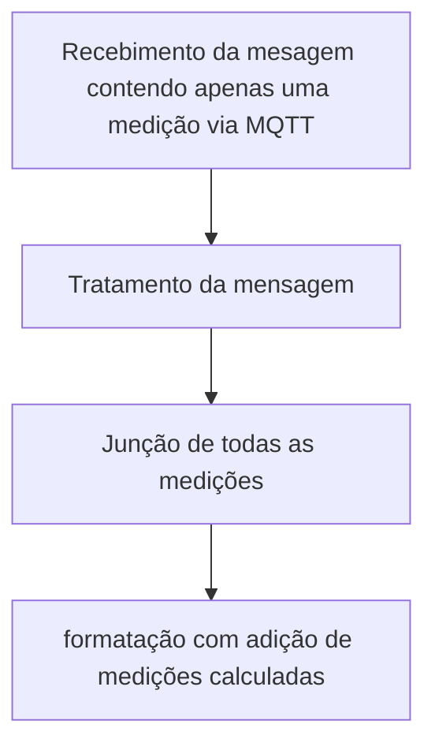

# Sumario
- [Node-red](#node-red)
	- [Mode de Execução](#mode-de-execucao)
	- [Funcionalidade Node-red](#funcionamento-node-red)
		- [Ferramentas](#ferramentas)
			- [Nodes](#nodes)
			- [Flows](#flows)
			- [Subflows](#subflows)
	- [Implementação](#implementação)
		- [Receive Data](#receive-data)
		- [Postgres](#postgres)
		- [Subflows](#subflows)
			- [MQTT](#mqtt)
			- [Tratamento da Mensagem](#tratamento-da-mensagem)
			- [Formatação](#formatacao)
			- [phase](#phase)
			- [Cria Instancia](#cria-instancia)
			- [Envio ao Banco](#envio-ao-banco)
			- [Sincronismo Medições](#sincronismo-medicoes)
			- [Sincronismo Local](#sincronismo-local)
			- [Sincronismo tamanho banco local](#sincronismo-tamanho-banco-local)
- [Conclusão](#conclusao)
- [Autor](#autor)
- [Anexos](#anexos)
	- [Anexo I - Aedes MQTT](#anexo-1)
	- [Anexo II - Não nulos](#anexo-2)
	- [Anexo III - Existe dados](#anexo-3)
	- [Anexo IV - convert payload](#anexo-4)
	- [Anexo V - Reconfigurção](#anexo-5)
	- [Anexo VI - Transformação String](#anexo-6)
	- [Anexo VII - Indentificação fase](#anexo-7)
	- [Anexo VIII - Junção (Monofasico/Bifasico/Trifasico)](#anexo-8)
	- [Anexo IX - Junção e Alteração](#anexo-9)
	- [Anexo X - Recuperação](#anexo-10)
	- [Anexo XI - Remoção](#anexo-11)


# <a name=“node-red”><a/>Node-red

Repositorio contendo todos os arquivos de configuração, palette e desenvolvimento do node-red para recebimento tratamento e disposição dos dados de medição de consumo ao banco dde dados.

<div> </div>


## <a name="mode-de-execucao"><a/>Modo de execução

Para executar essas configurações no Node-RED, é preciso ter instalado o Node-RED e o Postgres via Docker, como mostrado neste outro repositório ([instalação Docker](https://hub.docker.com/r/arthurcoelho442/monitor)).

**Atualização do sistema**

```
sudo apt-get update && apt-get upgrade -y
```


**Entre no modo de navegação root**
```
sudo su
```

**Navegue até a pasta do node-red**
```
cd /home/pi/node-red
```

**Inicialize o repositorio**
```
git init
```

**Adicione o repositorio remoto**
```
git remote add origin https://github.com/CPID-NOCS/node-red.git
```

**Limpe o repositorio local**
```
git clean -f
```

**Pegue as alterações do repositorio remoto**
```
git pull -f origin Arthur
```
pronto basta entrar com suas credenciais e logo logo as configurações serãao baixadas.

## <a name=“funcionamento-node-red”><a/>Funcionamento Node-Red

Node-RED é uma plataforma open-source baseada em Node.js para desenvolver aplicativos IoT (Internet of Things) e integração de sistemas. Ele permite que os usuários criem fluxos de trabalho visualmente, conectando nós pré-construídos de uma vasta biblioteca, chamados de nodes.

Os usuários podem criar um fluxo de trabalho usando uma interface gráfica de arrastar e soltar para conectar os nodes e criar uma lógica de programação. Os nodes podem ser usados para realizar ações como processamento de dados, controle de dispositivos, leitura e gravação em bancos de dados, envio e recebimento de dados via MQTT, HTTP, entre outros protocolos.

Os fluxos criados podem ser facilmente implantados em diferentes plataformas, incluindo nuvem, dispositivos locais e até mesmo em Raspberry Pi. Node-RED é altamente personalizável e extensível, permitindo que os usuários adicionem seus próprios nodes e personalizem os existentes para atender às suas necessidades.

Após a instalação, ao acessar a ferramenta você terá os seguintes componentes na tela.

- Lado esquerdo: Paleta com todos os Nodes (Nós) instalados.
- Centro: Ambiente de desenvolvimento. Onde ficam os Flows criados com suas automações baseado em nós.
- Lado direito: Você tem um conjunto de informações, área de ajuda, área de debug, configurações de layout.

<br>

> ### <a name=“ferramentas”><a/>Ferramentas

#### <a name=“nodes”><a/>Nodes

Nodes são os blocos de construção básicos do Node-RED, cada um representando uma função ou serviço específico. Os nodes são organizados em categorias, como entrada (input), saída (output), processamento (processing) e controle (function), e podem ser facilmente adicionados ao fluxo de trabalho arrastando e soltando da biblioteca de nodes.

<div align="center">
    <br>    
</div>

Os nodes incluem recursos como entrada de dados, conversão de dados, processamento de dados, saída de dados e controle de fluxo. Eles também podem ser personalizados e estendidos pelos usuários para atender às suas necessidades específicas.

#### <a name=“flows”><a/>Flows

Flows são o conjunto de nodes que formam o fluxo de trabalho em Node-RED. Os fluxos são criados arrastando e soltando os nodes na interface gráfica e conectando-os para criar uma lógica de programação visual. Os fluxos podem ser facilmente modificados, adicionando ou removendo nodes ou reorganizando sua conexão.

|<br> | <br> |
| :---: | :---: |

O Node-RED suporta a importação e exportação de fluxos, o que permite compartilhar e reutilizar fluxos entre usuários. Além disso, o Node-RED inclui um recurso de versionamento de fluxo que permite salvar e recuperar versões anteriores do fluxo.

#### <a name=“subflows”><a/>Subflows

Subflows são fluxos menores que podem ser encapsulados e reutilizados em um fluxo maior. Eles são úteis quando um conjunto de nodes é usado várias vezes em diferentes fluxos, permitindo que o usuário crie um subfluxo separado que pode ser adicionado a outros fluxos.

<div align="center">
    <br> 
</div>

Os subflows funcionam como nodes, mas contêm seu próprio conjunto de nodes e conexões. Eles podem ser facilmente criados arrastando e soltando nodes e conexões para um novo fluxo e salvando-o como um subfluxo. Os subfluxos são então adicionados ao fluxo principal arrastando e soltando como um único node.

## <a name=“implementação”><a/>Implementação

Inicialmente, temos todos os nodes separados em dois fluxos: o **Receive Data** e o **Postgres**. No primeiro fluxo, o **Receive Data**, temos o processo de recebimento, tratamento e adição de informações. Já no segundo, o **Postgres**, temos os nodes responsáveis pela comunicação entre o Node-RED e o banco de dados PostgreSQL. 



É importante ressaltar que em ambos os fluxos são utilizados subflows para simplificar o processo. Abaixo, seram destacados as funcionalidades e configurações de cada fluxo.

>### <a name=“receive-data”><a/>Receive Data

<div align="center">
    <br>
</div>

O fluxo de dados no receive se da na aquisição dos dados que veem via mqtt no subflow ***MQTT***, sendo que as mensagens eviadas pelos medidores da IE veem de forma separada, como por exemplo no medidor trifasico são enviados os dados separadamente, potencia ativa, potencia retiva, potencia aparente, corrent, tensão, fator de potencia, defasagem, etc, cada um em uma mensagem separada, logo no subflow ***Tratamento da mensagem*** as mensagem são tratadas e unidas para posteriormente serem formatadas no subflow ***Formatação***.

Logo abaixo temos uma mensagem que chega do medidor referente à corrente de fase A:

```json
{
  "packet": {
    "cmd" : "publish",
    "retain": false,
    "qos": 0,
    "dup" : false,
    "length" : "58",
    "topic" : "Trifasico",
    "payload": buffer[42]
  }
  "client":{}
}
```

Percebe-se que esta mensagem, além de conter o payload no formato buffer, contém também todos os dados do MQTT, como configuração de tópico, subtop, entre outros, sendo simplificada para se tornar:
```json
{
  "id" : "publish",
  "topic" : "Trifasico",
  "current_A": 0.83
}
```

Contudo, é unida a outras mensagens, tornando-se:

```json
{
    "id": "5",
    "topic": "Trifasico",
    "active_power_A": 67.93,
    "active_power_B": 121.27,
    "active_power_C": 30.11,
    "reactive_power_A": 59.5,
    "reactive_power_B": 97.7,
    "reactive_power_C": 4.59,
    "apparent_power_A": 90.27,
    "apparent_power_B": 155.72,
    "apparent_power_C": 30.46,
    "voltage_A": 128.04,
    "voltage_B": 128.25,
    "voltage_C": 128.75,
    "current_A": 0.84,
    "current_B": 1.22,
    "current_C": 0.3,
    "power_factor_A": 0.75,
    "power_factor_B": 0.77,
    "power_factor_C": 0.98,
    "voltage_current_angle_A": -90.03,
    "voltage_current_angle_B": 38.72,
    "voltage_current_angle_C": -90.03,
    "frequency": 59.97,
    "angle_voltage_A_B": 119.54,
    "angle_voltage_A_C": 240.18,
    "angle_voltage_B_C": 120.27,
    "temperature": 35.89
} 
```
Essa mensagem contém apenas os valores que serão utilizados para criar a instância de inserção dos dados no banco de dados.

>### <a name=“postgres”><a/>Postgres

<div align="center">
    <br>
</div>

O fluxo do Postgres funciona como uma ferramenta de conexão entre o Node-RED e o banco de dados, permitindo diversas interações com o banco. Por exemplo, é possível verificar o cadastro de um determinado usuário, sincronizar as tabelas locais com as informações do banco remoto, solicitar quais fases estão associadas a determinada medição, manter o banco de dados com uma quantidade específica de dados para evitar sobrecarga de memória e, por fim, inserir os dados medidos no banco de dados remoto.

Dentro desse fluxo, temos vários subfluxos que facilitam o trabalho com o banco de dados. Por exemplo, o subfluxo ***Verifica cadastro*** e ***phase*** fazem requisições ao banco remoto para averiguar informações. O subfluxo ***cria instancia*** é responsável por criar a instância no formato correto para inserção no banco de dados, e dentro dele, temos o subfluxo oculto ***sincronismo medições***, que detecta discrepâncias entre medições locais e remotas e envia as medições locais faltantes para o banco remoto.

Temos também o subfluxo ***envia ao banco***, que envia a medição já instanciada para o banco local e remoto, e o subfluxo oculto ***sincronismo local***, que mantém as tabelas locais de cadastro atualizadas com o banco remoto. Por fim, o subfluxo ***sincronismo tamanho banco local*** mantém o tamanho do banco de dados local em um tamanho fixo.

>### <a name=“subflows”><a/>Subflows

Agora vamos entrar em detalhes do funcionamento de cada subflow conttido nas dependencias do node-red.

#### <a name=“mqtt”><a/>MQTT

O subflow ***MQTT*** tem a função de capturar as mensagens recebidas pelo Node-RED local por meio do MQTT na porta 1883. Para garantir a qualidade das mensagens, o subflow transmite apenas aquelas que não possuem falhas, como mensagens nulas ou com payload vazio.

<div align="center">
    <br>
</div>

O fluxo do subflow começa com um node chamado **Aedes MQTT**(configuração no [Anexo-I](#anexo-1)), que funciona como um mosquito broker e coleta todas as mensagens que chegam na porta 1883 da Raspberry Pi. Em seguida, a mensagem passa pelo node **Não nulos**(configuração no [Anexo-II](#anexo-2)), que verifica se a mensagem não está vazia e se está conectada. Essas informações são cruciais para garantir a consistência das mensagens recebidas. Por fim, a mensagem passa pelo node **Existe dados**(configuração no [Anexo-III](#anexo-3)), que verifica se o payload da mensagem contém dados ou está vazio.

Além desses nodes, o subflow ***MQTT*** também possui nodes de status que informam a situação atual do node (conectado ou desconectado) e um node de aviso que informa caso ocorra algum problema em qualquer node do subflow.

#### <a name=“tratamento-da-mensagem”><a/>Tratamento da mensagem
O subfluxo ***Tratamento da mensagem*** é separado em dois fluxos: 

- Uma *Reconfiguração* que altera o formato da mensagem inicial, removendo informações que não são relevantes e remontando o objeto para uma melhor representação;

- E um *Identificação de Tópico e Junção*, que junta as mensagens de acordo com o tópico;

<div align="center">
    <br>
</div>
	
O objeto inicial chega no formato:
```json
{
  "packet": {
    "cmd" : "publish",
    "retain": false,
    "qos": 0,
    "dup" : false,
    "length" : "58",
    "topic" : "Trifasico",
    "payload": buffer[42]
  }
  "client":{}
}
```
e passa a ter o seguinte formato após a reconfiguração no primeiro fluxo:
```json
{
	"id":"5",
	"topic":"Trifasico",
	"variable":"IA",
	"value":1.08,
	"unit":"A"
}
```
Esse processo é realizado através dos nodos **convert payload**(configuração no [Anexo-IV](#anexo-4)), que converte o formato payload de buffer para um objeto JSON, e posteriormente as informações irrelevantes são removidas e o payload é reorganizado pelo nodulo **Reconfiguração**(configuração no [Anexo-V](#anexo-5)). Por fim, a mensagem é transformada em uma string JSON no nodulo **Trasformação String**(configuração no [Anexo-VI](#anexo-6)) para facilitar a união com as mensagens seguintes no fluxo de *Identificação de Tópico e Junção*. A união ocorre de forma diferente para cada tipo de módulo (monofásico, bifásico e trifásico), pois temos uma quantidade diferente de mensagens a serem unidas. Cada mensagem é identificada pelo nodulo **Identificação de fase**(configuração no [Anexo-VII](#anexo-7)), através do tópico em que a mensagem foi publicada. A união é realizada pelos nodulos **Junção Monofásico**, **Junção Bifásico** e **Junção Trifásico**(configuração de ambos no [Anexo-VIII](#anexo-8)).

Após a união, é necessário modificar a mensagem resultante, que chega no seguinte formato:
```
{"id":"5","topic":"Trifasico","variable":"PA","value":94.87,"unit":"W"},{"id":"5","topic":"Trifasico","variable":"PB","value":117.4,"unit":"W"},{"id":"5","topic":"Trifasico","variable":"PC","value":64.71,"unit":"W"},...}
```
Para isso removemos as junções `"},{"` e alteramos o formato basico de cada menagem, no caso da corrente de Fase A, a mensagem ´{"id":"5","topic":"Trifasico","variable":"IA","value":1.08,"unit":"W"}´ passa a ser `{"id":"5", topic":"Trifasico", "variable":"IA", value":1.08, unit":"A"}` e é unida as outras. Isso é feito pelo nodulo **Junção e Alteração**(configuração no [Anexo-IX](#anexo-9)).

Recuperação da Mensagem resultante de Json String para Json Object:
```json
{
	"id": "5",
	"topic": "Trifasico",
	"active_power_A": 90.69,
	"unit": "oC",
	"active_power_B": 28.73,
	"active_power_C": 60.69,
	"PT": 180.09,
	"reactive_power_A": 78.39,
	"reactive_power_B": 0.15,
	"reactive_power_C": -4.32,
	"QT": 74.25,
	"apparent_power_A": 119.85,
	"apparent_power_B": 28.73,
	"apparent_power_C": 60.8,
	"ST": 194.72,
	"voltage_A": 127.26,
	"voltage_B": 127.71,
	"voltage_C": 127.94,
	"current_A": 1.04,
	"current_B": 0.3,
	"current_C": 0.68,
	"IT": 0.75,
	"power_factor_A": 0.75,
	"power_factor_B": 0.99,
	"power_factor_C": 0.99,
	...
}
```
	
Muitos desses valores não são utilizados pelo projeto. Após a recuperação da string JSON para objeto JSON no nodulo **Recuperação**(configuração no [Anexo-X](#anexo-10)), os dados não utilizados, como 'unit', 'PT', 'QT', 'ST', e 'IT', são removidos pelo nodulo "Remoção"(configuração no [Anexo-XI](#anexo-11)), deixando o payload no seguinte formato:
	
```json
{
	"id": "5",
	"topic": "Trifasico",
	"active_power_A": 90.69,
	"active_power_B": 28.73,
	"active_power_C": 60.69,
	"reactive_power_A": 78.39,
	"reactive_power_B": 0.15,
	"reactive_power_C": -4.32,
	"apparent_power_A": 119.85,
	"apparent_power_B": 28.73,
	"apparent_power_C": 60.8,
	"voltage_A": 127.26,
	"voltage_B": 127.71,
	"voltage_C": 127.94,
	"current_A": 1.04,
	"current_B": 0.3,
	"current_C": 0.68,
	"power_factor_A": 0.75,
	"power_factor_B": 0.99,
	"power_factor_C": 0.99,
	...
}
```
	
#### <a name="formatacao"><a/>Formatação
#### <a name=“phase”><a/>phase
#### <a name="cria-instancia"><a/>Cria Instancia
#### <a name="envio-ao-banco"><a/>Envio ao banco
#### <a name="sincronismo-medicoes"><a/>Sincronismo Medições
#### <a name="sincronismo-local"><a/>Sincronismo Local
#### <a name="sincronismo-tamanho-banco-local"><a/>Sincronismo tamanho banco local

# <a name="conclusao"><a/>Conclusão

Node-RED é uma plataforma poderosa e flexível para a criação de fluxos de trabalho IoT e integração de sistemas. Com seus nodes personalizáveis, fluxos, subflows e outras ferramentas, é possível criar fluxos complexos de maneira visual e fácil de entender. Com a comunidade ativa de desenvolvedores, há sempre suporte para novos nodes e recursos, tornando o Node-RED uma solução escalável para projetos IoT e de integração de sistemas.

# <a name=“autor”><a/>Autor
| [<br><sub>Arthur Coelho Estevão</sub>](https://github.com/arthurcoelho442) |
| :---: |

# <a name="anexos"><a/>Anexos
Logo abaixo temos todos os anexos de configuração dos nodes
###
---
### <a name="anexo-1"><a/><div align="center"> Anexo I - Aedes MQTT </div>
<div align="center">
    <br>
</div>

---
### <a name="anexo-2"><a/><div align="center"> Anexo II - Não nulos</div>
	
<div align="center"> 
	<br>
</div>
	
---
### <a name="anexo-3"><a/><div align="center"> Anexo III - Existe dados</div>
	
<div align="center"> 
	<br>
</div>

---
### <a name="anexo-4"><a/><div align="center"> Anexo IV - convert payload</div>
	
<div align="center"> 
	<br>
</div>

---
### <a name="anexo-5"><a/><div align="center"> Anexo V - Reconfigurção</div>
	
<div align="center"> 
	<br>
</div>

---

### <a name="anexo-6"><a/><div align="center"> Anexo VI - Transformação String </div>
	
<div align="center"> 
	<br>
</div>

---
### <a name="anexo-7"><a/><div align="center"> Anexo VII - Indentificação fase</div>
	
<div align="center"> 
	<br>
</div>

---
### <a name="anexo-8"><a/><div align="center"> Anexo VIII - Junção (Monofasico/Bifasico/Trifasico)</div>
	
| <br><sub>Monofasico</sub> | <br><sub>Bifasico</sub>| <br><sub>Trifasico</sub> |
| :---: | :---: | :---: |

---	
### <a name="anexo-9"><a/><div align="center"> Anexo IX - Junção e Alteração</div>
	
| <br> | <br>| <br> |
| :---: | :---: | :---: |
| <br> | <br>| <br> |

	
---

### <a name="anexo-10"><a/><div align="center"> Anexo X - Recuperação</div>
	
<div align="center"> 
	<br>
</div>

---
### <a name="anexo-11"><a/><div align="center"> Anexo XI - Remoção</div>
	
| <br> | <br>|
| :---: | :---: |

---
